# Recommended EDU Device Configuration Settings for Windows 10/11 Devices

Configuring Windows devices in an education environment is challenging due to the different use-cases across the organization. 1 to 1 device configurations are different than shared carts or labs. Students have to be protected from being able to download and run applications that are inappropriate. Shared carts and lab devices need to be configured for specific use cases.

# Goal

The goal of this resource is to provide an easy way for EDU IT administrators to import a set of Microsoft recommended best practice settings for the following device use-cases in EDU

* 1 to 1 Device (faculty and student)
* Student User
* Shared Cart/Lab/Kiosk

These settings are not all-inclusive. There will be additional settings that should be added. If you have feedback, please [open an issue](https://github.com/rbalsleyMSFT/IntuneScripts/issues) or [pull request](https://github.com/rbalsleyMSFT/IntuneScripts/pulls).

# Outcome

When importing the Microsoft EDU device configuration settings from this repository, the following items are created. Each item that's imported is prefixed with _MSFT - EDU - *Device/Student* where *Device/Student* is the group that item should be targeted to. Most of these items will be targeted to device groups, while a few will go to student user groups to restrict students from doing certain things (e.g. installing apps that they shouldn't be installing).

Below you will find a screenshot of each configuration type that is imported. If you want a detailed list of what policies are included in each item, please refer to the [settings reference](https://github.com/rbalsleyMSFT/IntuneScripts/blob/main/ConfigurationProfileSettings/SettingReference.md).

## Configuration Profiles

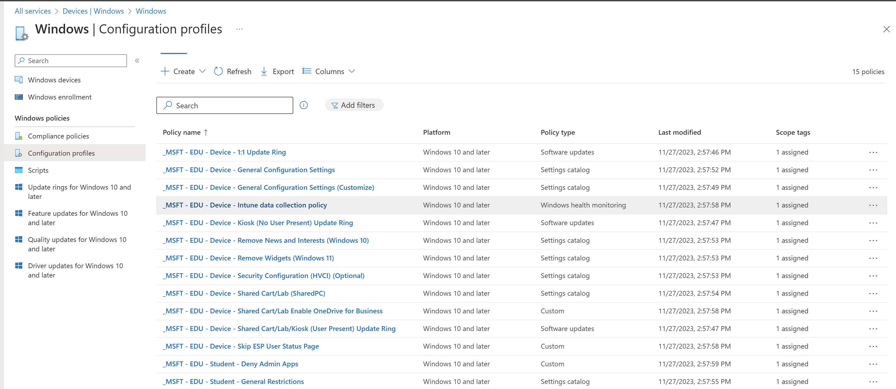

## Win32 Applications

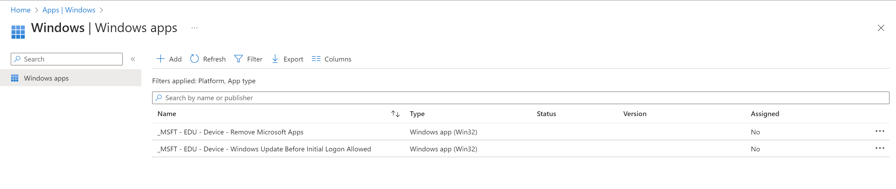

## Update rings

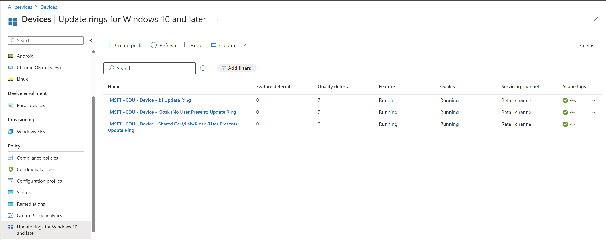

## Endpoint Security\Antivirus

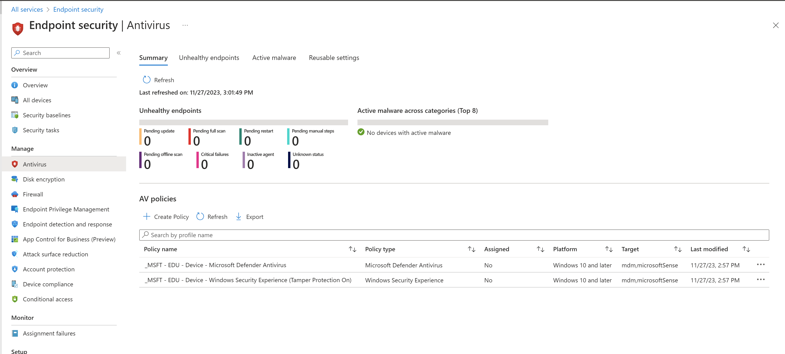

## Endpoint Security\Disk encryption

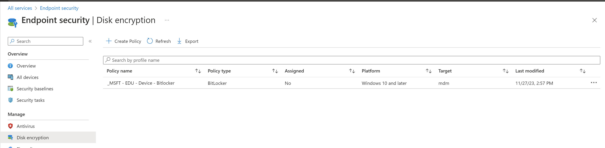

## Autopilot Profiles

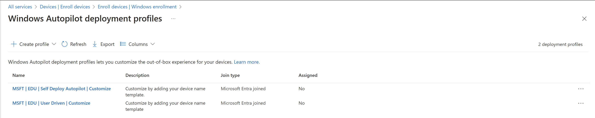

# Instructions

## YouTube Detailed Walkthrough

To import these settings, you will need to download the [IntuneManagement PowerShell script](https://github.com/Micke-K/IntuneManagement/archive/refs/heads/master.zip) from [Micke-K](https://github.com/Micke-K). This script will allow for easy import of these settings. This tool isn't supported by Microsoft. - [Read the documentation](https://github.com/Micke-K/IntuneManagement#readme) if you have any questions.

1. Download [IntuneManagement PowerShell script](https://github.com/Micke-K/IntuneManagement/archive/refs/heads/master.zip) and extract its contents.
2. Download [MSFT - EDU Recommended Intune Configuration.zip](https://github.com/rbalsleyMSFT/IntuneScripts/raw/main/ConfigurationProfileSettings/MSFT%20-%20EDU%20Recommended%20Intune%20Configurationv3.zip) and extract its contents
3. In the folder that you extracted the IntuneManagement PowerShell script to, double-click the start.cmd file. You may need to Unblock the start.cmd file before running (right-click the start.cmd file, select properties, then click the Unblock check box)
4. Sign-in with Global Admin or Intune Administrator permissions by clicking on the profile icon in the top right. It will ask you to consent permissions to the Intune Powershell App. Make sure to consent for your account and not on behalf of the tenant.
5. You may need to close and re-run start.cmd once permissions have been granted and/or sign out/sign in.
6. After reopening the script (if necessary), click Bulk - Import
7. In the Bulk Import window, change the Import root to the folder where you extracted the MSFT - EDU Recommended Intune Configuration.zip file. Make sure to also uncheck the Assign Scope (Tags) and Import Assignments check boxes. Your Bulk Import window should look like the following

   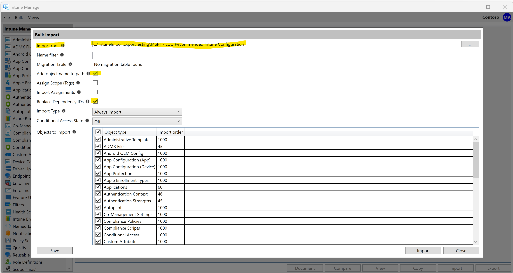
8. Click Import
9. In your Intune console, you should see items that have been imported just like the screenshots above for Device configuration profiles, Remediations, Update rings, Endpoint Security\Antivirus, and Endpoint Security\Disk encryption as well as two device Filters.
10. In each of the _MSFT - EDU imported items, target them to the appropriate device or user group. For each item that starts with **_MSFT - EDU - Device**, target to a device group. For each item that starts with **_MSFT - EDU - Student**, target to a student user group.
11. For the _MSFT - EDU - Device - Remove Widgets (Windows 11), this removes the Widgets feature in Windows 11. You can either target this to a group of Windows 11 devices, or target it to a group of Windows 10 and Windows 11 devices and use the MSFT - EDU - All Windows 11 Devices filter when targeting.
12. For the _MSFT - EDU - Device - Remove News and Interests (Windows 10), this removes the News and Interests feature in Windows 10. You can either target this to a group of Windows 10 devices, or target it to a group of Windows 10 and Windows 11 devices and use the MSFT - EDU - All Windows 10 Devices filter when targeting.

# Additional items to configure manually

There are some things that cannot be automated via this script that will need to be manually configured by the IT administrator.

## _MSFT - EDU - Device - General Configuration Settings (Customize)

This configuration profile item has a number of settings that you will need to customize for your environment

### Authentication

Set the UPN suffix of your school email address. This will make it so users don't have to type their full UPN when signing in

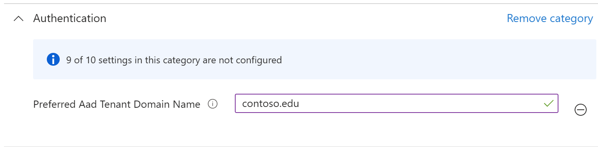

### Delivery Optimization

These settings leverage Microsoft Connected Cache, a standalone server that can store locally Windows Updates, Microsoft store apps, Intune apps, Office updates, etc. Think of it as an Intune distribution point that stores content within your environment. This can greatly improve the speed at which devices are provisioned since the devices don't have to go across the WAN to find content.

[Microsoft Connected Cache](https://learn.microsoft.com/en-us/windows/deployment/do/mcc-ent-edu-overview) (standalone) is currently in preview. [Sign up here](https://forms.office.com/Pages/ResponsePage.aspx?id=v4j5cvGGr0GRqy180BHbR-xPBiLHqBNHo7fpJB_69upUN0s5WVMzMUpaVFVNTTg1WjNMVldHVk05Qy4u) if you're interested in getting it set up in your environment.

If you have Configuration Manager distribution points, you can enable Connected Cache today. Go to your Configuration Manager console and under **Administration** select **Distribution Points**. **Right click** the **Distribution Point** you want to enable Microsoft Connected Cache on and select **Properties**. Check the **Enable this distribution point to be used as a Microsoft Connected Cache server** box.

Once setup, you'll want to adjust the DO Cache Host field to either be the FQDN of the Connected Cache server you set up, or the IP address.

The DO Min RAM allowed to peer setting at 100000 GB is intentional. It's to prevent clients from sharing content with one another and forcing clients to use the Connected Cache server.

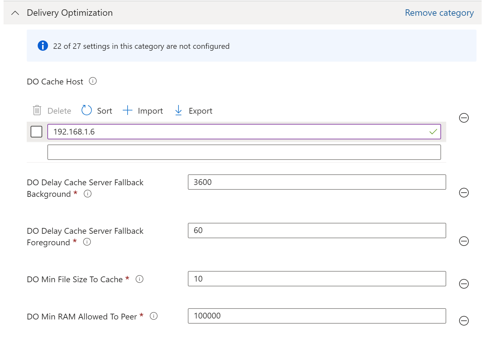

### OneDrive

Enter your [tenantID](https://portal.azure.com/#blade/Microsoft_AAD_IAM/ActiveDirectoryMenuBlade/Properties) in order for OneDrive Known folder move to silently configure OneDrive for your end users.

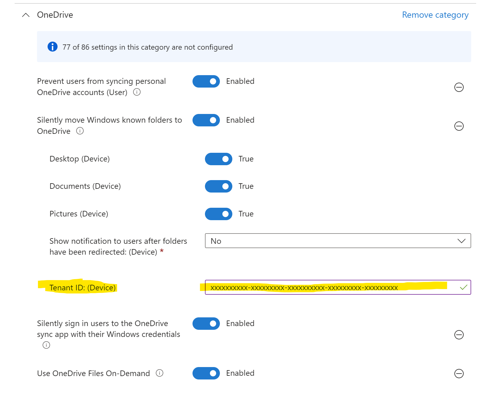

### Personalization

Enter a URL for the Desktop and Lock screen images on your Windows devices. The URL must go to a web server that houses a .png, .jpg, .jpeg. Sharepoint and other file sharing services are unlikely to work.

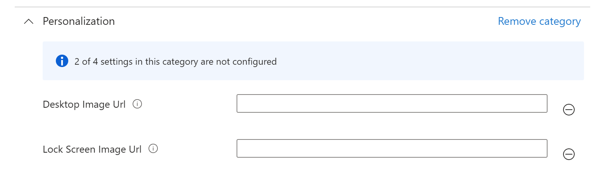

### Time Language Settings

Set the time zone using the Windows standard naming format. You can get the standard naming format by running tzutil /l

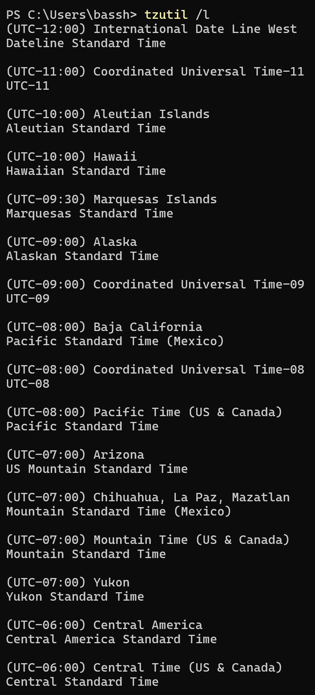

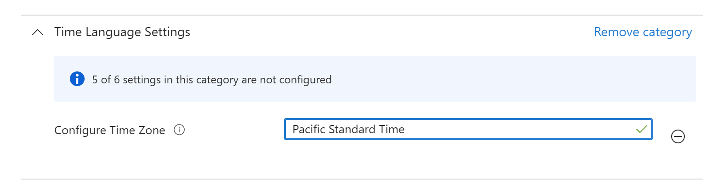

## Feature Updates

Go to **Devices - Feature updates for Windows 10 and later** and create a feature update policy to lock devices to a specific Windows release for the school year/term. If you don't do this and you target the Software Update rings that are imported via this method, the latest release of Windows will be deployed ASAP. Highly recommended that you create a feature update in Intune and target it ASAP.

## Windows Hello for Business

If you're in K12 and have students who don't have MFA (lack of cell phone), then you'll want to disable Windows Hello for Business. When setting up Windows for the first time, Hello for Business will prompt for MFA.

Disable this by going to Devices - Enroll devices - Windows enrollment - Windows Hello for Business and for Configure Windows Hello for Business, select Disabled.

For new EDU tenants, this is disabled by default. It's best to double check this, however.

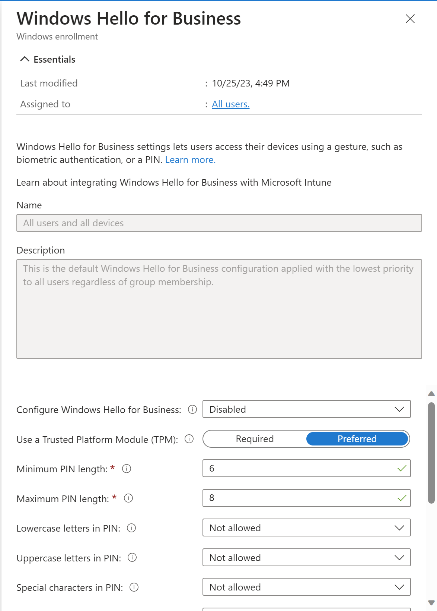

## Windows Data and Windows Licensing verification

For Remediations to work, you need to enable Windows licensing verification. While doing that, you should also enable Windows Data. Windows Data is needed for Windows feature update device readiness and compatability risk reports as well as Windows driver updates report.

Go to **Tenant Administration - Connectors and Tokens - Windows data** and under **Windows data** turn on **Enable features that require Windows diagnostic data in processor configuration**.

Under **Windows license verification**, turn on **I confirm that my tenant owns one of these licenses** if you do own one of the licenses in the list

## Windows Update for Business Reports

It's recommended that you also configure [Windows Update for Busines reports](https://learn.microsoft.com/en-us/windows/deployment/update/wufb-reports-prerequisites), which includes enhanced reporting information about your Windows Update posture compared to just what Intune provides

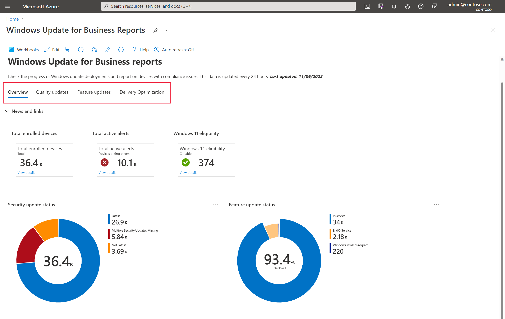
