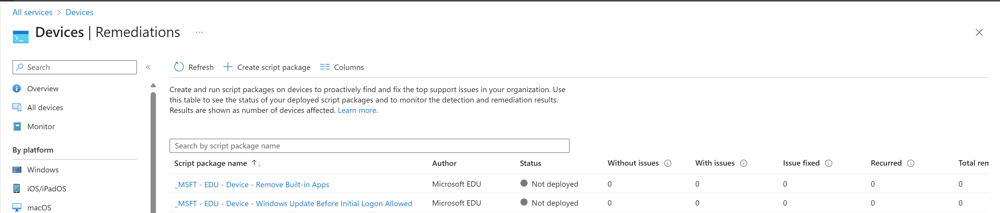

# Recommended EDU Device Configuration Settings for Windows 10/11 Devices

Configuring Windows devices in an education environment is challenging due to the different use-cases across the organization. 1 to 1 device configurations are different than shared carts or labs. Students have to be protected from being able to download and running applications that are inappropriate. Shared carts and lab devices need to be configured for specific use cases. 

# Goal

The goal of this resource is to provide an easy way for EDU IT administrators to import a set of Microsoft recommended best practice settings for the following device use-cases in EDU

* 1 to 1 Device (faculty and student)
* Student User
* Shared Cart/Lab
* Kiosk (coming soon)

These settings are not all-inclusive. There will be additional settings that should be added. If you have feedback, please [open an issue](https://github.com/rbalsleyMSFT/IntuneScripts/issues) or [pull request](https://github.com/rbalsleyMSFT/IntuneScripts/pulls).Outcome

When importing the Microsoft EDU device configuration settings from this repository, the following items are created. Each item that's imported is prefixed with _MSFT - EDU - *Device/Student* where *Device/Student* is the group that item should be targeted to. Most of these items will be targeted to device groups, while a few will go to student user groups to restrict students from doing certain things (e.g. installing apps that they shouldn't be installing)

## Configuration Profiles

## Remediations

## Update rings

## Endpoint Security\Antivirus

## Endpoint Security\Disk encryption

# Instructions

1. Download
