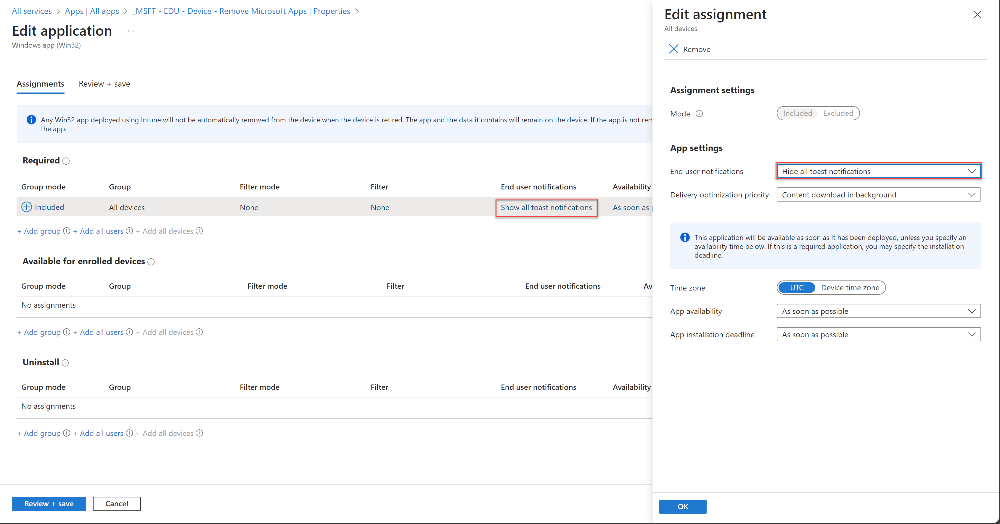
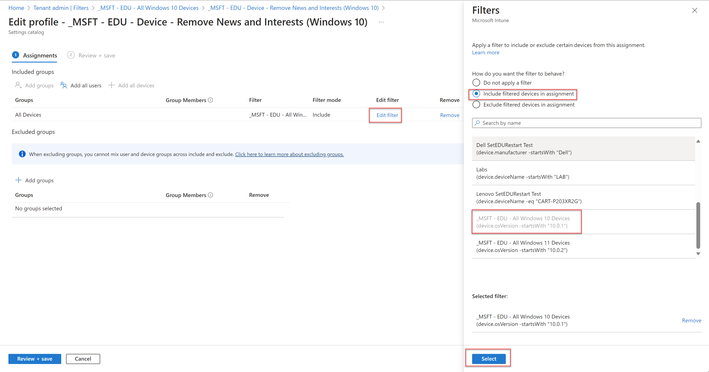

# EDU Device Configuration Settings Reference

The following guide serves as the settings reference for the Recommended EDU Device configuration settings for Windows 10/11 devices. It is broken down into the following sections:

* [Configuration Profiles](https://github.com/rbalsleyMSFT/IntuneScripts/blob/main/ConfigurationProfileSettings/SettingReference.md#configuration-profiles)
* [Win32 Applications](https://github.com/rbalsleyMSFT/IntuneScripts/blob/main/ConfigurationProfileSettings/SettingReference.md#win32-applications)
* [Update Rings](https://github.com/rbalsleyMSFT/IntuneScripts/blob/main/ConfigurationProfileSettings/SettingReference.md#update-rings)
* [Endpoint Security | Antivirus](https://github.com/rbalsleyMSFT/IntuneScripts/blob/main/ConfigurationProfileSettings/SettingReference.md#endpoint-security--antivirus)
* [Endpoint Security | Disk Encryption](https://github.com/rbalsleyMSFT/IntuneScripts/blob/main/ConfigurationProfileSettings/SettingReference.md#endpoint-security--disk-encryption)
* [Autopilot Profiles](https://github.com/rbalsleyMSFT/IntuneScripts/blob/main/ConfigurationProfileSettings/SettingReference.md#autopilot-profiles)
* [Filters](https://github.com/rbalsleyMSFT/IntuneScripts/blob/main/ConfigurationProfileSettings/SettingReference.md#filters)
* [Enrollment Status Page](https://github.com/rbalsleyMSFT/IntuneScripts/blob/main/ConfigurationProfileSettings/SettingReference.md#enrollment-status-page)

## Configuration Profiles

The following configuration profile types are used

- Settings Catalog
- Windows health monitoring
- Custom

While software updates are also listed in configuration profiles, those will be documented under the Update Rings section.

### Settings Catalog

The following settings catalog policies are imported. Please click on any of these to go directly to the documentation of what's in each of these policies.

- [_MSFT - EDU - Device - General Configuration Settings](https://github.com/rbalsleyMSFT/IntuneScripts/blob/main/ConfigurationProfileSettings/SettingReference.md#_msft---edu---device---general-configuration-settings)
- [_MSFT - EDU - Device - General Configuration Settings (Customize)](https://github.com/rbalsleyMSFT/IntuneScripts/blob/main/ConfigurationProfileSettings/SettingReference.md#_msft---edu---device---general-configuration-settings-customize)
- [_MSFT - EDU - Device - Remove News and Interests (Windows 10)](https://github.com/rbalsleyMSFT/IntuneScripts/blob/main/ConfigurationProfileSettings/SettingReference.md#_msft---edu---device---remove-news-and-interests-windows-10)
- [_MSFT - EDU - Device - Remove Widgets (Windows 11)](https://github.com/rbalsleyMSFT/IntuneScripts/blob/main/ConfigurationProfileSettings/SettingReference.md#_msft---edu---device---remove-widgets-windows-11)
- [_MSFT - EDU - Device - Security Configuration (HVCI) (Optional)](https://github.com/rbalsleyMSFT/IntuneScripts/blob/main/ConfigurationProfileSettings/SettingReference.md#_msft---edu---device---security-configuration-hvci-optional)
- [_MSFT - EDU - Device - Shared Cart/Lab (SharedPC)](https://github.com/rbalsleyMSFT/IntuneScripts/blob/main/ConfigurationProfileSettings/SettingReference.md#_msft---edu---device---shared-cartlab-sharedpc)
- [_MSFT - EDU - Student - General Restrictions](https://github.com/rbalsleyMSFT/IntuneScripts/blob/main/ConfigurationProfileSettings/SettingReference.md#_msft---edu---student---general-restrictions)

### _MSFT - EDU - Device - General Configuration Settings

### Authentication

| Setting (Category\Setting name)         | What it does                                                 | Value |
| --------------------------------------- | ------------------------------------------------------------ | ----- |
| Authentication\Allow Aad Password Reset | Specifies whether password reset is enabled for AAD accounts | Allow |

### Credential Providers

| Setting (Category\Setting name)                                  | What it does                                                                                                                                                       | Value    |
| ---------------------------------------------------------------- | ------------------------------------------------------------------------------------------------------------------------------------------------------------------ | -------- |
| Credential Providers\Disable Automatic Re Deployment Credentials | Enables local Autopilot Reset. At the sign-in screen, an administrator can hold the CTRL + Windows Key + R to invoke the custom sign-in screen for Autopilot Reset | Disabled |

### Defender

| Setting (Category\Setting name)          | What it does                                                                                                                                                                                                                                   | Value   |
| ---------------------------------------- | ---------------------------------------------------------------------------------------------------------------------------------------------------------------------------------------------------------------------------------------------- | ------- |
| Defender\Enable Controlled Folder Access | This policy enables setting the state (On/Off/Audit) for the controlled folder access feature. The controlled folder access feature removes modify and delete permissions from untrusted applications to certain folders such as My Documents. | Enabled |

### Experience

| Setting (Category\Setting name) | What it does                                                 | Value    |
| ------------------------------- | ------------------------------------------------------------ | -------- |
| Experience\Configure Chat Icon  | Configures the Teams Chat icon on the taskbar for Windows 11 | Disabled |

### Microsoft Edge

| Setting (Category\Setting name)                                                                                                | What it does                                                                                                                                                                                                                                                                                                                                                                                                                                                                                                                                                                                                                                                                                                                                                                                                                                                                                                                                                                                                                                                                                                                                                                                                                                                                                                                                                                                                                                                                                                                                                                                                                                                                                                                                                                                                                                                                                      | Value                                                                                  |
| ------------------------------------------------------------------------------------------------------------------------------ | ------------------------------------------------------------------------------------------------------------------------------------------------------------------------------------------------------------------------------------------------------------------------------------------------------------------------------------------------------------------------------------------------------------------------------------------------------------------------------------------------------------------------------------------------------------------------------------------------------------------------------------------------------------------------------------------------------------------------------------------------------------------------------------------------------------------------------------------------------------------------------------------------------------------------------------------------------------------------------------------------------------------------------------------------------------------------------------------------------------------------------------------------------------------------------------------------------------------------------------------------------------------------------------------------------------------------------------------------------------------------------------------------------------------------------------------------------------------------------------------------------------------------------------------------------------------------------------------------------------------------------------------------------------------------------------------------------------------------------------------------------------------------------------------------------------------------------------------------------------------------------------------------- | -------------------------------------------------------------------------------------- |
| Microsoft Edge\Allow recommendations and promotional notifications from Edge                                                   | This policy setting lets you decide whether employees should receive recommendations and in-product assistance notifications from Microsoft Edge. If you enable or don't configure this setting, employees receive recommendations / notifications from Microsoft Edge. If you disable this setting, employees will not receive any recommendations / notifications from Microsoft Edge.                                                                                                                                                                                                                                                                                                                                                                                                                                                                                                                                                                                                                                                                                                                                                                                                                                                                                                                                                                                                                                                                                                                                                                                                                                                                                                                                                                                                                                                                                                          | Disabled                                                                               |
| Microsoft Edge\Allow suggestions from local providers                                                                          | Allow suggestions from suggestion providers on the device (local providers), for example, Favorites and Browsing History, in Microsoft Edge's Address Bar and Auto-Suggest List. If you enable this policy, suggestions from local providers are used. If you disable this policy, suggestions from local providers are never used. Local history and local favorites suggestions will not appear. If you do not configure this policy, suggestions from local providers are allowed but the user can change that using the settings toggle. Note that some features may not be available if a policy to disable this feature has been applied. For example, Browsing History suggestions will not be available if you enable the 'SavingBrowserHistoryDisabled' (Disable saving browser history) policy. This policy requires a browser restart to finish applying.                                                                                                                                                                                                                                                                                                                                                                                                                                                                                                                                                                                                                                                                                                                                                                                                                                                                                                                                                                                                                              | Disabled                                                                               |
| Microsoft Edge\Allow surf game                                                                                                 | If you disable this policy, users won't be able to play the surf game when the device is offline or if the user navigates to edge://surf. If you enable or don't configure this policy, users can play the surf game.                                                                                                                                                                                                                                                                                                                                                                                                                                                                                                                                                                                                                                                                                                                                                                                                                                                                                                                                                                                                                                                                                                                                                                                                                                                                                                                                                                                                                                                                                                                                                                                                                                                                             | Disabled                                                                               |
| Microsoft Edge\Allow user feedback                                                                                             | Microsoft Edge uses the Edge Feedback feature (enabled by default) to allow users to send feedback, suggestions or customer surveys and to report any issues with the browser. Also, by default, users can't disable (turn off) the Edge Feedback feature. If you enable this policy or don't configure it, users can invoke Edge Feedback. If you disable this policy, users can't invoke Edge Feedback.                                                                                                                                                                                                                                                                                                                                                                                                                                                                                                                                                                                                                                                                                                                                                                                                                                                                                                                                                                                                                                                                                                                                                                                                                                                                                                                                                                                                                                                                                         | Disabled                                                                               |
| Microsoft Edge\Allow users to access the games menu                                                                            | If you enable or don't configure this policy, users can access the games menu. If you disable this policy, users won't be able to access the games menu.                                                                                                                                                                                                                                                                                                                                                                                                                                                                                                                                                                                                                                                                                                                                                                                                                                                                                                                                                                                                                                                                                                                                                                                                                                                                                                                                                                                                                                                                                                                                                                                                                                                                                                                                          | Disabled                                                                               |
| Microsoft Edge\Block all ads on Bing search results                                                                            | Enables an ad-free search experience on Bing.com If you enable this policy, then a user can search on bing.com and have an ad-free search experience. At the same time, the SafeSearch setting will be set to 'Strict' and can't be changed by the user. If you don't configure this policy, then the default experience will have ads in the search results on bing.com. SafeSearch will be set to 'Moderate' by default and can be changed by the user. This policy is only available for K-12 SKUs that are identified as EDU tenants by Microsoft. Please refer to https://go.microsoft.com/fwlink/?linkid=2119711 to learn more about this policy or if the following scenarios apply to you: * You have an EDU tenant, but the policy doesn't work. * You had your IP whitelisted for having an ad free search experience. * You were experiencing an ad-free search experience on Microsoft Edge Legacy and want to upgrade to the new version of Microsoft Edge.                                                                                                                                                                                                                                                                                                                                                                                                                                                                                                                                                                                                                                                                                                                                                                                                                                                                                                                          | Enabled                                                                                |
| Microsoft Edge\Block tracking of users' web-browsing activity                                                                  | Lets you decide whether to block websites from tracking users' web-browsing activity. If you enable this policy, you have the following options for setting the level of tracking prevention: * 0 = Off (no tracking prevention) * 1 = Basic (blocks harmful trackers, content and ads will be personalized) * 2 = Balanced (blocks harmful trackers and trackers from sites user has not visited; content and ads will be less personalized) * 3 = Strict (blocks harmful trackers and majority of trackers from all sites; content and ads will have minimal personalization. Some parts of sites might not work) If you disable this policy or don't configure it, users can set their own level of tracking prevention.                                                                                                                                                                                                                                                                                                                                                                                                                                                                                                                                                                                                                                                                                                                                                                                                                                                                                                                                                                                                                                                                                                                                                                       | Enabled (Strict)                                                                       |
| Microsoft Edge\Browser sign-in settings                                                                                        | Specify whether a user can sign into Microsoft Edge with their account and use account-related services like sync and single sign on. To control the availability of sync, use the 'SyncDisabled' (Disable synchronization of data using Microsoft sync services) policy instead. If you set this policy to 'Disable browser sign-in', make sure that you also set the 'NonRemovableProfileEnabled' (Configure whether a user always has a default profile automatically signed in with their work or school account) policy to disabled because 'NonRemovableProfileEnabled' disables the creation of an automatically signed in browser profile. If both policies are set, Microsoft Edge will use the 'Disable browser sign-in' policy and behave as if 'NonRemovableProfileEnabled' is set to disabled. If you set this policy to 'Enable browser sign-in' (1), users can sign into the browser. Signing into the browser doesn't mean that sync is turned on by default; the user must separately opt-in to use this feature. If you set this policy to 'Force browser sign-in' (2) users must sign into a profile to use the browser. By default, this will allow the user to choose whether they want to sync to their account, unless sync is disabled by the domain admin or with the 'SyncDisabled' policy. The default value of 'BrowserGuestModeEnabled' (Enable guest mode) policy is set to false. If you don't configure this policy users can decide if they want to enable the browser sign-in option and use it as they see fit. * 0 = Disable browser sign-in * 1 = Enable browser sign-in * 2 = Force users to sign-in to use the browser                                                                                                                                                                                                                                     | Enabled > Browser sign-in settings (Device): Force users to sign-in to use the browser |
| Microsoft Edge\Configure Do Not Track                                                                                          | Specify whether to send Do Not Track requests to websites that ask for tracking info. Do Not Track requests let the websites you visit know that you don't want your browsing activity to be tracked. By default, Microsoft Edge doesn't send Do Not Track requests, but users can turn on this feature to send them. If you enable this policy, Do Not Track requests are always sent to websites asking for tracking info. If you disable this policy, requests are never sent. If you don't configure this policy, users can choose whether to send these requests.                                                                                                                                                                                                                                                                                                                                                                                                                                                                                                                                                                                                                                                                                                                                                                                                                                                                                                                                                                                                                                                                                                                                                                                                                                                                                                                            | Enabled                                                                                |
| Microsoft Edge\Configure whether a user always has a default profile automatically signed in with their work or school account | This policy determines if a user can remove the Microsoft Edge profile automatically signed in with a user's work or school account. If you enable this policy, a non-removable profile will be created with the user's work or school account on Windows. This profile can't be signed out or removed. If you disable or don't configure this policy, the profile automatically signed in with a user's work or school account on Windows can be signed out or removed by the user. If you want to configure browser sign in, use the 'BrowserSignin' (Browser sign-in settings) policy.                                                                                                                                                                                                                                                                                                                                                                                                                                                                                                                                                                                                                                                                                                                                                                                                                                                                                                                                                                                                                                                                                                                                                                                                                                                                                                         | Enabled                                                                                |
| Microsoft Edge\Enable Drop feature in Microsoft Edge                                                                           | This policy lets you configure the Drop feature in Microsoft Edge. Drop lets users send messages or files to themselves. If you enable or don't configure this policy, you can use the Drop feature in Microsoft Edge. If you disable this policy, you can't use the Drop feature in Microsoft Edge.                                                                                                                                                                                                                                                                                                                                                                                                                                                                                                                                                                                                                                                                                                                                                                                                                                                                                                                                                                                                                                                                                                                                                                                                                                                                                                                                                                                                                                                                                                                                                                                              | Disabled                                                                               |
| Microsoft Edge\Enable full-tab promotional content                                                                             | Control the presentation of full-tab promotional or educational content. This setting controls the presentation of welcome pages that help users sign into Microsoft Edge, choose their default browser, or learn about product features. If you enable this policy (set it true) or don't configure it, Microsoft Edge can show full-tab content to users to provide product information. If you disable (set to false) this policy, Microsoft Edge can't show full-tab content to users.                                                                                                                                                                                                                                                                                                                                                                                                                                                                                                                                                                                                                                                                                                                                                                                                                                                                                                                                                                                                                                                                                                                                                                                                                                                                                                                                                                                                        | Disabled                                                                               |
| Microsoft Edge\Enable the Web widget                                                                                           | Enables the Web widget. When enabled, users can use the widget to search the web from their desktop or from an application. The widget provides a search box that shows web suggestions and opens all web searches in Microsoft Edge. The search box provides search (powered by Bing) and URL suggestions. The widget also includes feed tiles that users can click to see more information on msn.com in a new Microsoft Edge browser tab or window. The feed tiles may include ads. The widget can be launched from the Microsoft Edge settings or from the "More tools" menu in Microsoft Edge. If you enable or don't configure this policy: The Web widget will be automatically enabled for all profiles. In the Microsoft Edge settings, users will see option to launch the widget. In the Microsoft Edge settings, users will see the menu item to run the widget at Windows startup (auto-start). The option to enable the widget at startup will be toggled on if the 'WebWidgetIsEnabledOnStartup' (Allow the Web widget at Windows startup) policy is enabled. If the 'WebWidgetIsEnabledOnStartup' is disabled or not configured, the option to enable the widget at startup will be toggled off. Users will see the menu item to launch the widget from the Microsoft Edge "More tools" menu. Users can launch the widget from "More tools". The widget can be turned off by the "Quit" option in the System tray or by closing the widget from the taskbar. The widget will be restarted on system reboot if auto-start is enabled. If you disable this policy: The Web widget will be disabled for all profiles. The option to launch the widget from Microsoft Edge Settings will be disabled. The option to launch start the widget at Windows startup (auto-start) will be disabled. The option to launch the widget from Microsoft Edge "More tools" menu will be disabled. | Disabled                                                                               |
| Microsoft Edge\Enable travel assistance                                                                                        | Configure this policy to allow/disallow travel assistance. The travel assistance feature gives helpful and relevant information to a user who performs Travel related task within the browser. This feature provides trusted and validated suggestions / information to the users from across sources gathered by Microsoft. If you enable or don't configure this setting, travel assistance will be enabled for the users when they are performing travel related tasks. If you disable this setting, travel assistance will be disabled and users will not be able to see any travel related recommendations.                                                                                                                                                                                                                                                                                                                                                                                                                                                                                                                                                                                                                                                                                                                                                                                                                                                                                                                                                                                                                                                                                                                                                                                                                                                                                  | Disabled                                                                               |
| Microsoft Edge\Enforce Bing SafeSearch                                                                                         | Ensure that queries in Bing web search are done with SafeSearch set to the value specified. Users can't change this setting. If you configure this policy to "Off", SafeSearch in Bing search falls back to the bing.com value. If you configure this policy to "Moderate", the moderate setting is used in SafeSearch. The moderate setting filters adult videos and images but not text from search results. If you configure this policy to "Strict", the strict setting in SafeSearch is used. The strict setting filters adult text, images, and videos. If you disable this policy or don't configure it, SafeSearch in Bing search isn't enforced, and users can set the value they want on bing.com. * 0 = Don't configure search restrictions in Bing * 1 = Configure moderate search restrictions in Bing * 2 = Configure strict search restrictions in Bing                                                                                                                                                                                                                                                                                                                                                                                                                                                                                                                                                                                                                                                                                                                                                                                                                                                                                                                                                                                                                            | Enabled (Configure strict search restrictions in Bing)                                 |
| Microsoft Edge\Enforce Google SafeSearch                                                                                       | Forces queries in Google Web Search to be performed with SafeSearch set to active, and prevents users from changing this setting. If you enable this policy, SafeSearch in Google Search is always active. If you disable this policy or don't configure it, SafeSearch in Google Search isn't enforced.                                                                                                                                                                                                                                                                                                                                                                                                                                                                                                                                                                                                                                                                                                                                                                                                                                                                                                                                                                                                                                                                                                                                                                                                                                                                                                                                                                                                                                                                                                                                                                                          | Enabled                                                                                |
| Microsoft Edge\Force minimum YouTube Restricted Mode                                                                           | Enforces a minimum Restricted Mode on YouTube and prevents users from picking a less restricted mode. Set to Strict (2) to enforce Strict Restricted Mode on YouTube. Set to Moderate (1) to enforce the user to only use Moderate Restricted Mode and Strict Restricted Mode on YouTube. They can't disable Restricted Mode. Set to Off (0) or don't configure this policy to not enforce Restricted Mode on YouTube. External policies such as YouTube policies might still enforce Restricted Mode. * 0 = Do not enforce Restricted Mode on YouTube * 1 = Enforce at least Moderate Restricted Mode on YouTube * 2 = Enforce Strict Restricted Mode for YouTube                                                                                                                                                                                                                                                                                                                                                                                                                                                                                                                                                                                                                                                                                                                                                                                                                                                                                                                                                                                                                                                                                                                                                                                                                                | Enabled (Enforce Strict Restricted Mode for YouTube)                                   |
| Microsoft Edge\Force synchronization of browser data and do not show the sync consent prompt                                   | Forces data synchronization in Microsoft Edge. This policy also prevents the user from turning sync off. If you don't configure this policy, users will be able to turn sync on or off. If you enable this policy, users will not be able to turn sync off. For this policy to work as intended, 'BrowserSignin' (Browser sign-in settings) policy must not be configured, or must be set to enabled. If 'ForceSync' (Force synchronization of browser data and do not show the sync consent prompt) is set to disabled, then 'BrowserSignin' will not take affect. 'SyncDisabled' (Disable synchronization of data using Microsoft sync services) must not be configured or must be set to False. If this is set to True, 'ForceSync' will not take affect. 0 = Do not automatically start sync and show the sync consent (default) 1 = Force sync to be turned on for Azure AD/Azure AD-Degraded user profile and do not show the sync consent prompt                                                                                                                                                                                                                                                                                                                                                                                                                                                                                                                                                                                                                                                                                                                                                                                                                                                                                                                                           | Enabled                                                                                |
| Microsoft Edge\Hide the First-run experience and splash screen                                                                 | If you enable this policy, the First-run experience and the splash screen will not be shown to users when they run Microsoft Edge for the first time. For the configuration options shown in the First Run Experience, the browser will default to the following: -On the New Tab Page, the feed type will be set to MSN News and the layout to Inspirational. -The user will still be automatically signed into Microsoft Edge if the Windows account is of Azure AD or MSA type. -Sync will not be enabled by default and users will be able to turn on sync from the sync settings. If you disable or don't configure this policy, the First-run experience and the Splash screen will be shown. Note: The specific configuration options shown to the user in the First Run Experience, can also be managed by using other specific policies. You can use the HideFirstRunExperience policy in combination with these policies to configure a specific browser experience on your managed devices. Some of these other policies are: -'AutoImportAtFirstRun' (Automatically import another browser's data and settings at first run) -'NewTabPageLocation' (Configure the new tab page URL) -'NewTabPageSetFeedType' (Configure the Microsoft Edge new tab page experience) -'SyncDisabled' (Disable synchronization of data using Microsoft sync services) -'BrowserSignin' (Browser sign-in settings) -'NonRemovableProfileEnabled' (Configure whether a user always has a default profile automatically signed in with their work or school account)                                                                                                                                                                                                                                                                                                                                       | Enabled                                                                                |
| Microsoft Edge\In-app support Enabled                                                                                          | Microsoft Edge uses the in-app support feature (enabled by default) to allow users to contact our support agents directly from the browser. Also, by default, users can't disable (turn off) the in-app support feature. If you enable this policy or don't configure it, users can invoke in-app support. If you disable this policy, users can't invoke in-app support.                                                                                                                                                                                                                                                                                                                                                                                                                                                                                                                                                                                                                                                                                                                                                                                                                                                                                                                                                                                                                                                                                                                                                                                                                                                                                                                                                                                                                                                                                                                         | Disabled                                                                               |
| Microsoft Edge\Microsoft Edge Insider Promotion Enabled                                                                        | Shows content promoting the Microsoft Edge Insider channels on the About Microsoft Edge settings page. If you enable or don't configure this policy, the Microsoft Edge Insider promotion content will be shown on the About Microsoft Edge page. If you disable this policy, the Microsoft Edge Insider promotion content will not be shown on the About Microsoft Edge page.                                                                                                                                                                                                                                                                                                                                                                                                                                                                                                                                                                                                                                                                                                                                                                                                                                                                                                                                                                                                                                                                                                                                                                                                                                                                                                                                                                                                                                                                                                                    | Disabled                                                                               |
| Microsoft Edge\Restrict which accounts can be used as Microsoft Edge primary accounts                                          | Determines which accounts can be set as browser primary accounts in Microsoft Edge (the account that is chosen during the Sync opt-in flow). If a user tries to set a browser primary account with a username that doesn't match this pattern, they are blocked and see an appropriate error message. If you don't configure this policy or leave it blank, users can set any account as a browser primary account in Microsoft Edge. Example value: .*@contoso.com                                                                                                                                                                                                                                                                                                                                                                                                                                                                                                                                                                                                                                                                                                                                                                                                                                                                                                                                                                                                                                                                                                                                                                                                                                                                                                                                                                                                                               | Enabled (.*@contoso.com)                                                               |
| Microsoft Edge\Shopping in Microsoft Edge Enabled                                                                              | This policy lets users compare the prices of a product they are looking at, get coupons from the website they're on, or auto-apply coupons during checkout. If you enable or don't configure this policy, shopping features such as price comparison and coupons will be automatically applied for retail domains. Coupons for the current retailer and prices from other retailers will be fetched from a server. If you disable this policy shopping features such as price comparison and coupons will not be automatically found for retail domains.                                                                                                                                                                                                                                                                                                                                                                                                                                                                                                                                                                                                                                                                                                                                                                                                                                                                                                                                                                                                                                                                                                                                                                                                                                                                                                                                          | Disabled                                                                               |
| Microsoft Edge\Show Hubs Sidebar                                                                                               | Shows a launcher bar on the right side of Microsoft Edge's screen. Enable this policy to always show the Sidebar. Disable this policy to never show the Sidebar. If you don't configure the policy, users can choose whether to show the Sidebar.                                                                                                                                                                                                                                                                                                                                                                                                                                                                                                                                                                                                                                                                                                                                                                                                                                                                                                                                                                                                                                                                                                                                                                                                                                                                                                                                                                                                                                                                                                                                                                                                                                                 | Disabled                                                                               |
| Microsoft Edge\Show Microsoft Rewards experiences                                                                              | Show Microsoft Rewards experience and notifications. If you enable this policy: - Microsoft account users (excludes Azure AD accounts) in search and earn markets will see the Microsoft Rewards experience in their Microsoft Edge user profile. - The setting to enable Microsoft Rewards in Microsoft Edge settings will be enabled and toggled on. - The setting to enable Give mode will be enabled and respect the user's setting. If you disable this policy: - Microsoft account users (excludes Azure AD accounts) in search and earn markets will not see the Microsoft Rewards experience in their Microsoft Edge user profile. - The setting to enable Microsoft Rewards in Microsoft Edge settings will be disabled and toggled off. If you don't configure this policy: - Microsoft account users (excludes Azure AD accounts) in search and earn markets will see the Microsoft Rewards experience in their Microsoft Edge user profile. - The setting to enable Microsoft Rewards in Microsoft Edge settings will be enabled and toggled on. - The setting to enable Give mode will be enabled and respect the user's setting.                                                                                                                                                                                                                                                                                                                                                                                                                                                                                                                                                                                                                                                                                                                                                    | Disabled                                                                               |
| Microsoft Edge\Sites that can access audio capture devices without requesting permission                                       | Specify websites, based on URL patterns, that can use audio capture devices without asking the user for permission. Patterns in this list are matched against the security origin of the requesting URL. If they match, the site is automatically granted access to audio capture devices. Example value: https://www.contoso.com/ https://[\*.]contoso.edu/                                                                                                                                                                                                                                                                                                                                                                                                                                                                                                                                                                                                                                                                                                                                                                                                                                                                                                                                                                                                                                                                                                                                                                                                                                                                                                                                                                                                                                                                                                                                      | https://[\*.]flipgrid.com; https://[\*.]microsoft.com                                  |
| Microsoft Edge\Sites that can access video capture devices without requesting permission                                       | Specify websites, based on URL patterns, that can use video capture devices without asking the user for permission. Patterns in this list are matched against the security origin of the requesting URL. If they match, the site is automatically granted access to video capture devices. Example value: https://www.contoso.com/ https://[\*.]contoso.edu/                                                                                                                                                                                                                                                                                                                                                                                                                                                                                                                                                                                                                                                                                                                                                                                                                                                                                                                                                                                                                                                                                                                                                                                                                                                                                                                                                                                                                                                                                                                                      | https://[\*.]flipgrid.com; https://[\*.]microsoft.com                                  |
| Microsoft Edge\Experimentation\Configure users ability to override feature flags                                               | Configures users ability to override state of feature flags. If you set this policy to 'CommandLineOverridesEnabled', users can override state of feature flags using command line arguments but not edge://flags page. If you set this policy to 'OverridesEnabled', users can override state of feature flags using command line arguments or edge://flags page. If you set this policy to 'OverridesDisabled', users can't override state of feature flags using command line arguments or edge://flags page. If you don't configure this policy, the behavior is the same as the 'OverridesEnabled'. Policy options mapping: * CommandLineOverridesEnabled (2) = Allow users to override feature flags using command line arguments only * OverridesEnabled (1) = Allow users to override feature flags * OverridesDisabled (0) = Prevent users from overriding feature flags Use the preceding information when configuring this policy.                                                                                                                                                                                                                                                                                                                                                                                                                                                                                                                                                                                                                                                                                                                                                                                                                                                                                                                                                     | Prevent users from overriding feature flags                                            |
| Microsoft Edge\Identity and sign-in\Enable implicit sign-in                                                                    | Configure this policy to allow/disallow implicit sign-in. If you have configured the 'BrowserSignin' (Browser sign-in settings) policy to 'Disable browser sign-in', this policy will not take any effect. If you enable or don't configure this setting, implicit sign-in will be enabled, Edge will attempt to sign the user into their profile based on what and how they sign in to their OS. If you disable this setting, implicit sign-in will be disabled.                                                                                                                                                                                                                                                                                                                                                                                                                                                                                                                                                                                                                                                                                                                                                                                                                                                                                                                                                                                                                                                                                                                                                                                                                                                                                                                                                                                                                                 | Enabled                                                                                |
| Microsoft Edge\SmartScreen settings\Configure Microsoft Defender SmartScreen to block potentially unwanted apps                | This policy setting lets you configure whether to turn on blocking for potentially unwanted apps with Microsoft Defender SmartScreen. Potentially unwanted app blocking with Microsoft Defender SmartScreen provides warning messages to help protect users from adware, coin miners, bundleware, and other low-reputation apps that are hosted by websites. Potentially unwanted app blocking with Microsoft Defender SmartScreen is turned off by default. If you enable this setting, potentially unwanted app blocking with Microsoft Defender SmartScreen is turned on. If you disable this setting, potentially unwanted app blocking with Microsoft Defender SmartScreen is turned off. If you don't configure this setting, users can choose whether to use potentially unwanted app blocking with Microsoft Defender SmartScreen. This policy is available only on Windows instances that are joined to a Microsoft Active Directory domain; or on Windows 10 Pro or Enterprise instances that are enrolled for device management.                                                                                                                                                                                                                                                                                                                                                                                                                                                                                                                                                                                                                                                                                                                                                                                                                                                       | Enabled                                                                                |
| Microsoft Edge\Startup, home page and new tab page\Action to take on startup                                                   | Specify how Microsoft Edge behaves when it starts. If you want a new tab to always open on startup, choose 'Open new tab' (5). If you want to reopen URLs that were open the last time Microsoft Edge closed, choose 'Restore the last session' (1). The browsing session will be restored as it was. Note that this option disables some settings that rely on sessions or that perform actions on exit (such as Clear browsing data on exit or session-only cookies). If you want to open a specific set of URLs, choose 'Open a list of URLs' (4). Disabling this setting is equivalent to leaving it not configured. Users will be able to change it in Microsoft Edge. This policy is available only on Windows instances that are joined to a Microsoft Active Directory domain or Windows 10 Pro or Enterprise instances enrolled for device management. * 1 = Restore the last session * 4 = Open a list of URLs * 5 = Open a new tab                                                                                                                                                                                                                                                                                                                                                                                                                                                                                                                                                                                                                                                                                                                                                                                                                                                                                                                                                     | Restore the last session                                                               |
| Microsoft Edge\Startup, home page and new tab page\Configure the home page URL                                                 | Configures the default home page URL in Microsoft Edge. The home page is the page opened by the Home button. The pages that open on startup are controlled by the 'RestoreOnStartup' (Action to take on startup) policies. You can either set a URL here or set the home page to open the new tab page. If you select to open the new tab page, then this policy doesn't take effect. If you enable this policy, users can't change their home page URL, but they can choose to use the new tab page as their home page. If you disable or don't configure this policy, users can choose their own home page, as long as the 'HomepageIsNewTabPage' (Set the new tab page as the home page) policy isn't enabled. This policy is available only on Windows instances that are joined to a Microsoft Active Directory domain or Windows 10 Pro or Enterprise instances enrolled for device management. Example value: https://www.contoso.com                                                                                                                                                                                                                                                                                                                                                                                                                                                                                                                                                                                                                                                                                                                                                                                                                                                                                                                                                      | https://office.com/?auth=2 (the auth=2 is what allows for SSO to Office.com)           |
| Microsoft Edge\Startup, home page and new tab page\Configure the new tab page URL                                              | Configures the default URL for the new tab page. This policy determines the page that's opened when new tabs are created (including when new windows are opened). It also affects the startup page if that's set to open to the new tab page. This policy doesn't determine which page opens on startup; that's controlled by the 'RestoreOnStartup' (Action to take on startup) policy. It also doesn’t affect the home page if that’s set to open to the new tab page. If you don't configure this policy, the default new tab page is used. If you configure this policy*and* the 'NewTabPageSetFeedType' (Configure the Microsoft Edge new tab page experience) policy, this policy has precedence. If an invalid URL is provided, new tabs will open about://blank. This policy is available only on Windows instances that are joined to a Microsoft Active Directory domain or Windows 10 Pro or Enterprise instances that are enrolled for device management. Example value: https://www.fabrikam.com                                                                                                                                                                                                                                                                                                                                                                                                                                                                                                                                                                                                                                                                                                                                                                                                                                                                                 | https://office.com/?auth=2                                                             |
| Microsoft Edge\Startup, home page and new tab page\Show Home button on toolbar                                                 | Shows the Home button on Microsoft Edge's toolbar. Enable this policy to always show the Home button. Disable it to never show the button. If you don't configure the policy, users can choose whether to show the home button.`<br><br>` **Note** If the screen is smaller and the home page button is taking up space, this policy can be disabled or not configured to allow the end user to choose whether to have the home page button. Some schools instruct students to click the home page button to get back to a school resource (LMS, school home page, etc)                                                                                                                                                                                                                                                                                                                                                                                                                                                                                                                                                                                                                                                                                                                                                                                                                                                                                                                                                                                                                                                                                                                                                                                                                                                                                                                   | Enabled                                                                                |

### Microsoft Edge Password Manager

**NOTE** the following password manager and protection settings are counter to securty best practices. The reason these are recommended has to do with students who may have issues with long/complex passwords. If this is the case for your students, set the below settings. If you disable Enable saving passwords to the password manager, the other three settings aren't needed. However if you want to allow Edge to save passwords, then the other three options might be useful if your students have issues with complex passwords.

| Setting (Category\Setting name)                                                                                                             | What it does                                                                                                                                                                                                                                                                                                                                                                                                                                                                                                                                                                                                                                                                                                                                                                                                                                                                                                                                                                                                                                                                                                                                                                                                                                                                           | Value                                        |
| ------------------------------------------------------------------------------------------------------------------------------------------- | -------------------------------------------------------------------------------------------------------------------------------------------------------------------------------------------------------------------------------------------------------------------------------------------------------------------------------------------------------------------------------------------------------------------------------------------------------------------------------------------------------------------------------------------------------------------------------------------------------------------------------------------------------------------------------------------------------------------------------------------------------------------------------------------------------------------------------------------------------------------------------------------------------------------------------------------------------------------------------------------------------------------------------------------------------------------------------------------------------------------------------------------------------------------------------------------------------------------------------------------------------------------------------------- | -------------------------------------------- |
| Microsoft Edge\Password manager and protection\Enable saving passwords to the password manager                                              | Enable Microsoft Edge to save user passwords. If you enable this policy, users can save their passwords in Microsoft Edge. The next time they visit the site, Microsoft Edge will enter the password automatically. If you disable this policy, users can't save new passwords, but they can still use previously saved passwords. If you enable or disable this policy, users can't change or override it in Microsoft Edge. If you don't configure it, users can save passwords, as well as turn this feature off.                                                                                                                                                                                                                                                                                                                                                                                                                                                                                                                                                                                                                                                                                                                                                                   | Disabled                                     |
| Microsoft Edge\Password manager and protection\Allow users to be alerted if their passwords are found to be unsafe                          | If students have issues with strong/long/complex passwords, Edge will alert the user that the password is unsafe. Disabling this will provide less alerts.                                                                                                                                                                                                                                                                                                                                                                                                                                                                                                                                                                                                                                                                                                                                                                                                                                                                                                                                                                                                                                                                                                                             | Disabled                                     |
| Microsoft Edge\Password manager and protection\Allow users to get a strong password suggestion whenever they are creating an account online | Configures the Password Generator Settings toggle that enables/disables the feature for users. If you enable or don't configure this policy, then Password Generator will offer users a strong and unique password suggestion (via a dropdown) on Signup and Change Password pages. If you disable this policy, users will no longer see strong password suggestions on Signup or Change Password pages.                                                                                                                                                                                                                                                                                                                                                                                                                                                                                                                                                                                                                                                                                                                                                                                                                                                                               | Disabled                                     |
| Microsoft Edge\Password manager and protection\Configure password protection warning trigger                                                | Allows you to control when to trigger password protection warning. Password protection alerts users when they reuse their protected password on potentially suspicious sites. You can use the 'PasswordProtectionLoginURLs' (Configure the list of enterprise login URLs where password protection service should capture fingerprint of password) and 'PasswordProtectionChangePasswordURL' (Configure the change password URL) policies to configure which passwords to protect. Exemptions: Passwords for the sites listed in 'PasswordProtectionLoginURLs' and 'PasswordProtectionChangePasswordURL', as well as for the sites listed in 'SmartScreenAllowListDomains' (Configure the list of domains for which Microsoft Defender SmartScreen won't trigger warnings), will not trigger a password-protection warning. Set to 'PasswordProtectionWarningOff' (0) to not show password protection warningss. Set to 'PasswordProtectionWarningOnPasswordReuse' (1) to show password protection warnings when the user reuses their protected password on a non-allowlisted site. If you disable or don't configure this policy, then the warning trigger is not shown. * 0 = Password protection warning is off. * 1 = Password protection warning is triggered by password reuse. | Enabled (Password protection warning is off) |

### Microsoft Office 2016 (Machine)

If your students or end users don't use Teams for collaboration, it's best to prevent Microsoft 365 Apps from being able to install Teams as it can be distracting for users who don't use it.

| Setting (Category\Setting name)                                                                                   | What it does                                                                                                                                                                                                                                                                                                                                                                                                                                                                                                                                                                                                                                                                                                    | Value   |
| ----------------------------------------------------------------------------------------------------------------- | --------------------------------------------------------------------------------------------------------------------------------------------------------------------------------------------------------------------------------------------------------------------------------------------------------------------------------------------------------------------------------------------------------------------------------------------------------------------------------------------------------------------------------------------------------------------------------------------------------------------------------------------------------------------------------------------------------------- | ------- |
| Microsoft Office 2016 (Machine)\Updates\Don't install Microsoft Teams with new installations or updates of Office | This policy setting allows you to control whether Microsoft Teams is installed with a new installation of Office or when an existing installation of Office is updated. Note: This policy setting only applies to versions of Office, such as Office 365 ProPlus, where Teams is installed with a new installation or an update of Office. If you enable this policy setting, Teams won’t be installed with a new installation or an update of Office. If you disable or don’t configure this policy setting, Teams will be installed as part of a new installation or an update of Office, unless you have used some other method, such as the Office Deployment Tool, to exclude the installation of Teams. | Enabled |

### Privacy

In order for Windows Locate Device to work from the Intune portal, you need to allow apps to access location

| Setting (Category\Setting name)  | What it does                                                                                  | Value        |
| -------------------------------- | --------------------------------------------------------------------------------------------- | ------------ |
| Privacy\Let Apps Access Location | If using the remote action Locate Device, Let Apps Access Location must be set to Force Allow | Force allow. |

### System

These settings are needed for [Windows Update for Business reports](https://learn.microsoft.com/en-us/windows/deployment/update/wufb-reports-overview)

| Setting (Category\Setting name)                                | What it does                                                                                                                                                                                                                                                                   | Value                                  |
| -------------------------------------------------------------- | ------------------------------------------------------------------------------------------------------------------------------------------------------------------------------------------------------------------------------------------------------------------------------ | -------------------------------------- |
| System\Allow device name to be sent in Windows diagnostic data | This policy allows the device name to be sent to Microsoft as part of Windows diagnostic data.                                                                                                                                                                                 | Allowed                                |
| System\Allow Telemetry                                         | Required (Basic) is required to be set in order for WUfB Reports to show data.[Learn more](https://learn.microsoft.com/en-us/windows/privacy/configure-windows-diagnostic-data-in-your-organization#diagnostic-data-settings) about the different levels of telemetry.            | Basic                                  |
| System\Configure Telemetry Opt In Change Notification          | Disables user notifications that appear for changes to the diagnostic data level.                                                                                                                                                                                              | Disable telemetry change notifications |
| System\Configure Telemetry Opt In Settings Ux                  | Determines whether users of the device can adjust diagnostic data to levels lower than you define by the*AllowTelemetry* policy. Set the recommended value to disable opt-in settings, or users can change the effective diagnostic data level that might not be sufficient. | Disable Telemetry opt-in Settings.     |

### _MSFT - EDU - Device - General Configuration Settings (Customize)

### Authentication

| Setting (Category\Setting name)                 | What it does                                                                                                                                                                                                                                                                                                         | Value       |
| ----------------------------------------------- | -------------------------------------------------------------------------------------------------------------------------------------------------------------------------------------------------------------------------------------------------------------------------------------------------------------------- | ----------- |
| Authentication\Preferred Aad Tenant Domain Name | Configure your school's domain name so that users can sign in to Windows without it. For example, instead of signing in with the username*alain\@contoso.com*, a student would only need to sign in with *alain*. When configured, this setting prepopulates your tenant domain name, but you can still edit it. | contoso.com |

### Delivery Optimization

| Setting (Category\Setting name)                                 | What it does                                                                                                                                                                                                                                                                                                                                                                                                                                                                                                                                                       | Value                                                                       |
| --------------------------------------------------------------- | ------------------------------------------------------------------------------------------------------------------------------------------------------------------------------------------------------------------------------------------------------------------------------------------------------------------------------------------------------------------------------------------------------------------------------------------------------------------------------------------------------------------------------------------------------------------ | --------------------------------------------------------------------------- |
| Delivery Optimization\DO Cache Host                             | When using Microsoft Connected Cache (either Connected Cache standalone, or when a Configuration Manager Distribution Point is enabled with Connected Cache), enter the name or IP address of the server. It is recommended EDU customers take advantage of Connected Cache to help speed up deployments and reduce bandwidth - for more info and to sign up for the preview go to https://learn.microsoft.com/en-us/windows/deployment/do/mcc-ent-edu-overview                                                                                                    | Hostname or IP Address                                                      |
| Delivery Optimization\DO Delay Cache Server Fallback Background | Specifies the time in seconds to delay the fallback from Cache Server to the HTTP source for a background content download. NoteThe DODelayBackgroundDownloadFromHttp policy takes precedence over this policy to allow downloads from peers first.                                                                                                                                                                                                                                                                                                                | 3600                                                                        |
| Delivery Optimization\DO Delay Cache Server Fallback Foreground | Specifies the time in seconds to delay the fallback from Cache Server to the HTTP source for foreground content download. NoteThe DODelayForegroundDownloadFromHttp policy takes precedence over this policy to allow downloads from peers first.                                                                                                                                                                                                                                                                                                                  | 60                                                                          |
| Delivery Optimization\DO Min File Size To Cache                 | Specifies the minimum content file size in MB enabled to use Peer Caching.                                                                                                                                                                                                                                                                                                                                                                                                                                                                                         | 10                                                                          |
| Delivery Optimization\DO Min RAM Allowed To Peer                | Specifies the minimum RAM size in GB required to use Peer Caching. For example, if the minimum set is 1 GB, then devices with 1 GB or higher available RAM will be allowed to use Peer caching.**Note** This setting is only used to prevent peer-to-peer content sharing and force clients to use Microsoft Connected Cache. There isn't a policy that tells the clients to use or prefer connected cache or peer-to-peer. In this instance, set the Min RAM Allowed to Peer to a value larger than the maximum amount of RAM in your client PCs (e.g 1000) | 1000 (or some number larger than the most amount of RAM in your client PCs) |

### OneDrive

| Setting (Category\Setting name)                                                                                                  | What it does                                                                                                                                                                                                                                                                                                                                                                                                                                                                                                                                                                                                                                                                                                                                                                                                                                                                                                                                                                                                                                                                                       | Value                                                                                                                        |
| -------------------------------------------------------------------------------------------------------------------------------- | -------------------------------------------------------------------------------------------------------------------------------------------------------------------------------------------------------------------------------------------------------------------------------------------------------------------------------------------------------------------------------------------------------------------------------------------------------------------------------------------------------------------------------------------------------------------------------------------------------------------------------------------------------------------------------------------------------------------------------------------------------------------------------------------------------------------------------------------------------------------------------------------------------------------------------------------------------------------------------------------------------------------------------------------------------------------------------------------------- | ---------------------------------------------------------------------------------------------------------------------------- |
| OneDrive\Prevent users from syncing personal OneDrive accounts (User)                                                            | **Note** Even though this is flagged as a (User) policy, it will still apply when targeting to a group of devices. This setting lets you block users from signing in with a Microsoft account to sync their personal OneDrive files. If you enable this setting, users will be prevented from setting up a sync relationship for their personal OneDrive account. Users who are already syncing their personal OneDrive when you enable this setting won't be able to continue syncing (and will be shown a message that syncing has stopped), but any files synced to the computer will remain on the computer. If you disable or do not configure this setting, users can sync their personal OneDrive accounts.                                                                                                                                                                                                                                                                                                                                                                           | Enabled                                                                                                                      |
| OneDrive\Silently move Windows known folders to OneDrive                                                                         | This setting lets you redirect known folders to OneDrive without any user interaction. In sync app builds below 18.171.0823.0001, this setting only redirects empty known folders to OneDrive (or known folders already redirected to a different OneDrive account). In later builds, it redirects known folders that contain content and moves the content to OneDrive. We recommend using this setting together with "Prompt users to move Windows known folders to OneDrive." If moving the known folders silently does not succeed, users will be prompted to correct the error and continue. If you enable this setting and provide your tenant ID, you can choose whether to display a notification to users after their folders have been redirected. You can move all folders at once or select the folders you want to move. After a folder is moved, this policy will not affect that folder again, even if you clear the check box for the folder. If you disable or do not configure this setting, your users' known folders will not be silently redirected and/or moved to OneDrive. | Enabled                                                                                                                      |
| OneDrive\Silently move Windows known folders to OneDrive\Desktop (Device)                                                        |                                                                                                                                                                                                                                                                                                                                                                                                                                                                                                                                                                                                                                                                                                                                                                                                                                                                                                                                                                                                                                                                                                    | True                                                                                                                         |
| OneDrive\Silently move Windows known folders to OneDrive\Documents (Device)                                                      |                                                                                                                                                                                                                                                                                                                                                                                                                                                                                                                                                                                                                                                                                                                                                                                                                                                                                                                                                                                                                                                                                                    | True                                                                                                                         |
| OneDrive\Silently move Windows known folders to OneDrive\Pictures (Device)                                                       |                                                                                                                                                                                                                                                                                                                                                                                                                                                                                                                                                                                                                                                                                                                                                                                                                                                                                                                                                                                                                                                                                                    | True                                                                                                                         |
| OneDrive\Silently move Windows known folders to OneDrive\Show notification to users after folders have been redirected: (Device) |                                                                                                                                                                                                                                                                                                                                                                                                                                                                                                                                                                                                                                                                                                                                                                                                                                                                                                                                                                                                                                                                                                    | No                                                                                                                           |
| OneDrive\Silently move Windows known folders to OneDrive\Tenant ID: (Device)                                                     |                                                                                                                                                                                                                                                                                                                                                                                                                                                                                                                                                                                                                                                                                                                                                                                                                                                                                                                                                                                                                                                                                                    | Your TenantID (can be found in the[Entra Portal](https://entra.microsoft.com/#view/Microsoft_AAD_IAM/TenantOverview.ReactView)) |
| OneDrive\Silently sign in users to the OneDrive sync app with their Windows credentials                                          | This setting lets you silently sign in users to the OneDrive sync app (OneDrive.exe) with their Windows credentials. If you enable this setting, users who are signed in on the PC with the primary Windows account (the account used to join the PC to the domain) can set up the sync app without entering the credentials for the account. Users will still be shown OneDrive Setup so they can select folders to sync and change the location of their OneDrive folder. If a user is using the previous OneDrive for Business sync app (Groove.exe), the new sync app will attempt to take over syncing the user's OneDrive from the previous app and preserve the user's sync settings. This setting is frequently used together with "Set the maximum size of a user's OneDrive that can download automatically" on PCs that don't have Files On-Demand, and "Set the default location for the OneDrive folder." If you disable or do not configure this setting, users will need to sign in with their work or school account to set up sync.                                               | Enabled                                                                                                                      |
| OneDrive\Use OneDrive Files On-Demand                                                                                            | This setting lets you control whether OneDrive Files On-Demand is enabled for your organization. If you enable this setting, OneDrive Files On-Demand will be turned on by default. If you disable this setting, OneDrive Files On-Demand will be explicitly disabled and users can't turn it on. If you do not configure this setting, users can turn OneDrive Files On-Demand on or off.                                                                                                                                                                                                                                                                                                                                                                                                                                                                                                                                                                                                                                                                                                         | Enabled                                                                                                                      |
|                                                                                                                                  |                                                                                                                                                                                                                                                                                                                                                                                                                                                                                                                                                                                                                                                                                                                                                                                                                                                                                                                                                                                                                                                                                                    |                                                                                                                              |

### Personalization

| Setting (Category\Setting name)       | What it does                                                                                                                                                                                                     | Value                                                                 |
| ------------------------------------- | ---------------------------------------------------------------------------------------------------------------------------------------------------------------------------------------------------------------- | --------------------------------------------------------------------- |
| Personalization\Desktop Image Url     | A http or https Url to a jpg, jpeg or png image that needs to be downloaded and used as the Desktop Image or a file Url to a local image on the file system that needs to be used as the Desktop Image.          | HTTP URL to jpg,jpeg, or png file (e.g. http://contoso.edu/image.jpg) |
| Personalization\Lock Screen Image Url | A http or https Url to a jpg, jpeg or png image that neeeds to be downloaded and used as the Lock Screen Image or a file Url to a local image on the file system that needs to be used as the Lock Screen Image. | HTTP URL to jpg,jpeg, or png file (e.g. http://contoso.edu/image.jpg) |

### Time Language Settings

| Setting (Category\Setting name)            | What it does                                                                                                                                      | Value                 |
| ------------------------------------------ | ------------------------------------------------------------------------------------------------------------------------------------------------- | --------------------- |
| Time Language Settings\Configure Time Zone | Sets the Time Zone using the Windows name format. You can find the correct format to use by running tzutil /l from a command prompt or powershell | Pacific Standard Time |

### _MSFT - EDU - Device - Remove News and Interests (Windows 10)

### News and Interests

| Setting (Category\Setting name)              | What it does                                                                                                                                                                                          | Value        |
| -------------------------------------------- | ----------------------------------------------------------------------------------------------------------------------------------------------------------------------------------------------------- | ------------ |
| News and interests\Enable News and interests | This policy setting specifies whether News and interests is allowed on the device. This setting is only applicable to Windows 10 devices and will result in errors if deployed to Windows 11 devices. | Not allowed. |

### _MSFT - EDU - Device - Remove Widgets (Windows 11)

### Widgets

| Setting (Category\Setting name) | What it does                                                                                                                                                                               | Value        |
| ------------------------------- | ------------------------------------------------------------------------------------------------------------------------------------------------------------------------------------------ | ------------ |
| Widgets\Allow Widgets           | This policy setting specifies whether Widgets is allowed on the device. This setting is only applicable to Windows 11 devices and will result in errors if deployed to Windows 10 devices. | Not allowed. |

### _MSFT - EDU - Device - Security Configuration (HVCI) (Optional)

Configures Memory Integrity also known as Hypervisor-protected code integrity (HVCI). This is enabled by default on new installs of Windows 11 22H2+ on Intel 8th gen and AMD Zen 2 or later processors. Deploying this will configure it for machines that were not newly installed with Windows 11 22H2+. This will fix the warning about Memory Integrity not being configured in Windows Security center.

Memory integrity works better with Intel Kabylake and higher processors with *Mode-Based Execution Control*, and AMD Zen 2 and higher processors with *Guest Mode Execute Trap* capabilities. Older processors rely on an emulation of these features, called *Restricted User Mode*, and will have a bigger impact on performance.

Some applications and hardware device drivers may be incompatible with memory integrity. This incompatibility can cause devices or software to malfunction and in rare cases may result in a boot failure (blue screen). Such issues may occur after memory integrity has been turned on or during the enablement process itself. If compatibility issues occur, see [Troubleshooting](https://learn.microsoft.com/en-us/windows/security/hardware-security/enable-virtualization-based-protection-of-code-integrity#troubleshooting) for remediation steps.

This configuration profile also configures System Guard Secure Launch which defends against firmware attacks. More info about System Guard Secure Launch can be found [here](https://learn.microsoft.com/en-us/windows/security/hardware-security/how-hardware-based-root-of-trust-helps-protect-windows).

Configuring both of these settings plus Bitlocker allows for the device to be configured as a [Secured-Core PC.](https://learn.microsoft.com/en-us/windows-hardware/design/device-experiences/oem-highly-secure-11)

We mark this configuration profile as optional due to the hardware requirements for memory integrity. Please test this configuration on a group of devices before deploying to production. While this allows for an increased security state of the device, potential performance and driver/application compatibility issues could arise.

### Device Guard

| Setting (Category\Setting name)            | What it does                                                                                                                                                        | Value                                                    |
| ------------------------------------------ | ------------------------------------------------------------------------------------------------------------------------------------------------------------------- | -------------------------------------------------------- |
| Device Guard\Configure System Guard Launch | Configures[Windows Defender System Guard](https://learn.microsoft.com/en-us/windows/security/hardware-security/how-hardware-based-root-of-trust-helps-protect-windows) | Unmanaged Enables Secure Launch if supported by hardware |

### Virtualization Based Technology

| Setting (Category\Setting name)                                    | What it does                                                                                                                                             | Value                                                                                  |
| ------------------------------------------------------------------ | -------------------------------------------------------------------------------------------------------------------------------------------------------- | -------------------------------------------------------------------------------------- |
| Virtualization Based Technology\Hypervisor Enforced Code Integrity | Configures[Memory integrity](https://learn.microsoft.com/en-us/windows/security/hardware-security/enable-virtualization-based-protection-of-code-integrity) | (Enabled without lock) Turns on Hypervisor-Protected Code Integrity without UEFI lock. |

### _MSFT - EDU - Device - Shared Cart/Lab (SharedPC)

For shared device scenarios (Carts and Labs) we recommend using SharedPC. SharedPC will provide the optimal settings for an EDU shared configuration, allowing the device to clean up stale user profiles, configure power policy settings to allow the device to wake up and allow Windows Update to install updates outside of class time, and improved performance and enhanced privacy for users.

For more information, check out the [Shared PC technical reference](https://learn.microsoft.com/en-us/windows/configuration/shared-pc-technical) for a list of the local policies Shared PC configures.

Note that if you want to use OneDrive for Business, a custom policy needs to be configured outside of the Settings catalog. The current SharedPC configuration in the Intune UI doesn't have the OneDrive for Business sync policy available yet.

### Shared PC

| Setting (Category\Setting name)  | What it does                                                                                                                                                                                         | Value                                                 |
| -------------------------------- | ---------------------------------------------------------------------------------------------------------------------------------------------------------------------------------------------------- | ----------------------------------------------------- |
| Shared PC\Account Model          | Configures which type of accounts are allowed to use the PC.                                                                                                                                         | Guest and Domain                                      |
| Shared PC\Deletion Policy        | Configures when accounts will be deleted.                                                                                                                                                            | Delete at disk space threshold and inactive threshold |
| Shared PC\Disk Level Caching     | Stop deleting accounts when available disk space reaches this threshold, given as percent of total disk capacity.                                                                                    | 50                                                    |
| Shared PC\Disk Level Deletion    | Accounts will start being deleted when available disk space falls below this threshold, given as percent of total disk capacity. Accounts that have been inactive the longest will be deleted first. | 25                                                    |
| Shared PC\Enable Account Manager | Enable the account manager for shared PC mode (this enables the removal of stale user profiles)                                                                                                      | true                                                  |
| Shared PC\Enable Shared PC Mode  | Setting this node to "true" triggers the action to configure a device to Shared PC mode.                                                                                                             | true                                                  |
| Shared PC\Inactive Threshold     | Accounts will start being deleted when they have not been logged on during the specified period, given as number of days                                                                             | 90                                                    |
| Shared PC\Maintenance Start Time | Daily start time of maintenance hour. Given in minutes from midnight. Default is 0 (12am).                                                                                                           | 0                                                     |
| Shared PC\Restrict Local Storage | Restricts the user from using local storage.                                                                                                                                                         | true                                                  |
| Shared PC\Set Edu Policies       | Configures[the following local GPO settings](https://learn.microsoft.com/en-us/windows/configuration/shared-pc-technical#setedupolicy)                                                                  | true                                                  |
| Shared PC\Set Power Policies     | Configures[the following power settings via local GPO](https://learn.microsoft.com/en-us/windows/configuration/shared-pc-technical#setpowerpolicies)                                                    | true                                                  |
| Shared PC\Sign In On Resume      | Require signing in on waking up from sleep.                                                                                                                                                          | false                                                 |

### _MSFT - EDU - Student - General Restrictions

**Student User Settings**

These settings are primarily targeted to student users to prevent them from being able to install applications via the internet, USB drive, etc. When non-student users (teachers, IT Admins) sign on to student devices, these policies will not be applied (it may take a minute or so for the policy to sync down and remove the student restrictions after signing in).

**Note: Preventing Students from installing apps**

This process leverages Smart Screen and the Windows Store app to funnel application installs to the Store, however the Store will be blocked, preventing the user from being able to install apps. All self-service application installs should go through the Company Portal. Students will be able to use the Company Portal app to install applications you've made available to them via Intune (assuming you don't have any [primary user issues](https://github.com/rbalsleyMSFT/IntuneScripts/tree/main/ChangeIntunePrimaryUser)).

Using Windows Defender Application Control (WDAC) or Applocker both have their challenges. We've found using Smart Screen and blocking the store as an easy way to solve for this while preserving device usability and manageability.

### Accounts

| Setting (Category\Setting name)                       | What it does                                                                                                                                                                                                                                                                         | Value |
| ----------------------------------------------------- | ------------------------------------------------------------------------------------------------------------------------------------------------------------------------------------------------------------------------------------------------------------------------------------ | ----- |
| Accounts\Allow Adding Non Microsoft Accounts Manually | Specifies whether user is allowed to add non-MSA email accounts. Most restricted value is 0. Note This policy will only block UI/UX-based methods for adding non-Microsoft accounts. Even if this policy is enforced, you can still provision non-MSA accounts using the EMAIL2 CSP. | Block |
| Accounts\Allow Microsoft Account Connection           | Specifies whether the user is allowed to use an MSA account for non-email related connection authentication and services. Most restricted value is 0.                                                                                                                                | Block |

### Administrative Templates\Windows Components

| Setting (Category\Setting name)                                                                                    | What it does                                                                                                                                                                                                                                                                                                                                                                                                                                                                                                                                                                                                                                               | Value   |
| ------------------------------------------------------------------------------------------------------------------ | ---------------------------------------------------------------------------------------------------------------------------------------------------------------------------------------------------------------------------------------------------------------------------------------------------------------------------------------------------------------------------------------------------------------------------------------------------------------------------------------------------------------------------------------------------------------------------------------------------------------------------------------------------------- | ------- |
| Administrative Templates\Windows Components > Store\Turn off the Store application (User)                          | Denies or allows access to the Store application. If you enable this setting, access to the Store application is denied. Access to the Store is required for installing app updates. If you disable or don't configure this setting, access to the Store application is allowed.                                                                                                                                                                                                                                                                                                                                                                           | Enabled |
| Administrative Templates\Windows Components > Attachment Manager\Hide mechanisms to remove zone information (User) | This policy setting allows you to manage whether users can manually remove the zone information from saved file attachments by clicking the Unblock button in the file's property sheet or by using a check box in the security warning dialog. Removing the zone information allows users to open potentially dangerous file attachments that Windows has blocked users from opening. If you enable this policy setting, Windows hides the check box and Unblock button. If you disable this policy setting, Windows shows the check box and Unblock button. If you do not configure this policy setting, Windows hides the check box and Unblock button. | Enabled |

### Microsoft App Store

| Setting (Category\Setting name)                                            | What it does                                                                                                                                                                                           | Value   |
| -------------------------------------------------------------------------- | ------------------------------------------------------------------------------------------------------------------------------------------------------------------------------------------------------ | ------- |
| Microsoft App Store\Allow apps from the Microsoft app store to auto update | Specifies whether automatic update of apps from Microsoft Store are allowed. This is necessary to configure if the Microsoft Store is blocked to allow inbox apps to update (Notepad, Calculator, etc) | Enabled |

### Security

| Setting (Category\Setting name)                     | What it does                                                                                                                                                  | Value                                                                                                |
| --------------------------------------------------- | ------------------------------------------------------------------------------------------------------------------------------------------------------------- | ---------------------------------------------------------------------------------------------------- |
| Security\Allow Add Provisioning Package             | Specifies whether to allow the runtime configuration agent to install provisioning packages.                                                                  | Block                                                                                                |
| Security\Allow Remove Provisioning Package          | Specifies whether to allow the runtime configuration agent to remove provisioning packages.                                                                   | Block                                                                                                |
| Security\Recovery Environment Authentication (User) | This policy controls the requirement of Admin Authentication in RecoveryEnvironment. This should prevent students getting into WinRE and resetting the device | RequireAuthentication: Admin authentication is always required for components in RecoveryEnvironment |

### Smart Screen

| Setting (Category\Setting name)                  | What it does                                                                                                                                           | Value   |
| ------------------------------------------------ | ------------------------------------------------------------------------------------------------------------------------------------------------------ | ------- |
| Smart Screen\Enable App Install Control          | This policy setting is intended to prevent malicious content from affecting your user's devices when downloading executable content from the internet. | Enable  |
| Smart Screen\Enable Smart Screen In Shell        | Allows IT Admins to configure SmartScreen for Windows                                                                                                  | Enabled |
| Smart Screen\Prevent Override For Files In Shell | Allows IT Admins to control whether users can ignore SmartScreen warnings and run malicious files.                                                     | Enabled |

### Windows Health Monitoring

These settings configure both Windows Update reports in Intune, as well as Endpoint Analytics to collect data about your devices and report on them.

The following policy is imported

### _MSFT - EDU - Device - Intune data collection policy

| Setting (Category\Setting name) | What it does                                                                                                                                                                                                                                                                                                                                                                                                                                                            | Value         |
| ------------------------------- | ----------------------------------------------------------------------------------------------------------------------------------------------------------------------------------------------------------------------------------------------------------------------------------------------------------------------------------------------------------------------------------------------------------------------------------------------------------------------- | ------------- |
| Health Monitoring               | Enables event collection from devices running Windows 10 or later                                                                                                                                                                                                                                                                                                                                                                                                       | Enable        |
| Scope                           | **Windows updates** this must be selected in order for Windows Update Reports in Intune to show any data. Do not confuse this with Windows Update for Business Reports (there are different settings to enable that data to be reported for clients). [Click here for more info](https://learn.microsoft.com/en-us/mem/intune/protect/windows-update-reports)                                                                                                        | Check the box |
| Scope                           | **Endpoint analytics** this allows for data to be collected for the Endpoint Analytics service to collect things like boot data and other telemetry to report on the health and performance of your devices. If you enabled Endpoint analytics already, this policy may already be configured. Check to see if you have any Windows Health Monitoring profile templates already configured in your tenant (could be under the name Intune data collection policy) | Check the box |

### Custom

The following custom policies are imported

- [_MSFT - EDU - Device - Shared Cart/Lab Enable OneDrive for Business](https://github.com/rbalsleyMSFT/IntuneScripts/blob/main/ConfigurationProfileSettings/SettingReference.md#_msft---edu---device---shared-cartlab-enable-onedrive-for-business)
- [_MSFT - EDU - Device - Skip ESP User Status Page](https://github.com/rbalsleyMSFT/IntuneScripts/blob/main/ConfigurationProfileSettings/SettingReference.md#_msft---edu---device---skip-esp-user-status-page)
- [_MSFT - EDU - Student - Deny Admin Apps](https://github.com/rbalsleyMSFT/IntuneScripts/blob/main/ConfigurationProfileSettings/SettingReference.md#_msft---edu---student---deny-admin-apps)

### _MSFT - EDU - Device - Shared Cart/Lab Enable OneDrive for Business

In Windows 11 22H2 SharedPC CSP was modified to allow for OneDrive for Business sync. Intune has yet to add this to the Shared PC settings, so for now this must be set via a custom OMA-URI setting. If you wish for your shared devices to have the ability to sync with OneDrive, you'll want to add this setting.

**Name:** Enable ODfB SharedPC
**OMA-URI:** ./Vendor/MSFT/SharedPC/EnableSharedPCModeWithOneDriveSync
**Data Type:** Boolean
**Value:** True

### _MSFT - EDU - Device - Skip ESP User Status Page

The Enrollment Status Page (ESP) has three phases

- Device preparation
- Device setup
- Account setup

The Device preparation phase enrolls the device in Intune and installs the Intune Management extension which is responsible for installing Win32 apps, remediations, device inventory, and much more.

The Device setup phase applies apps and polices that are targeted to the device.

The Account setup phase does the same as the device setup phase, but for the user.

The Account setup phase can take a very long time to process, increasing the amount of time it takes for a student or end-user to be able to use the device. For profiles that are targeted to users, they generally are applied right on sign in and with minimal delay that the Account setup phase is generally not needed.

**Name:** Skip ESP User Status Page
**OMA-URI:** ./Device/Vendor/MSFT/DMClient/Provider/MS DM Server/FirstSyncStatus/SkipUserStatusPage
**Data Type:** Boolean
**Value:** True

### _MSFT - EDU - Student - Deny Admin Apps

The following settings are primarily focused on student users to prevent them from being able to run administrative apps: cmd, powershell, reg, regedit, and terminal.

**Name:** Deny Admin apps EXE
**Description:** Block selected Administrative Apps: Cmd, PS, Regedit, or Registry Console Tool.
**OMA-URI:** ./Vendor/MSFT/AppLocker/ApplicationLaunchRestrictions/IntuneEdu/EXE/Policy
**Data Type:** String (XML File)

Download XML file - https://github.com/rbalsleyMSFT/IntuneScripts/blob/main/BlockAdminApps/BlockAdminAppsEXE.xml

**Name:** Deny Microsoft Terminal
**Description:** Deny Microsoft Terminal
**OMA-URI:** ./Vendor/MSFT/AppLocker/ApplicationLaunchRestrictions/IntuneEdu/StoreApps/Policy
**Data Type:** String (XML File)

Download XML file - https://github.com/rbalsleyMSFT/IntuneScripts/blob/main/BlockAdminApps/BlockAdminAppsAppx.xml

## Remediations

Remediations have been removed in favor of using Win32 apps.

## Win32 Applications

There are two Win32 applications that we provide. One removes built-in Windows apps, the other allows for devices to run Windows update without users signing in.

* _MSFT - EDU - Device - Remove Microsoft Apps
* _MSFT - EDU - Device - Windows Update Before Initial Logon Allowed

For these two use cases, Win32 apps are preferred over Remediations due to predicability. When provisioning a new device, Win32 apps can be configured to be required via the Enrollment Status Page, whereas with Remediations, they cannot be relied on to run at a specific time (they can be scheduled to run at a specific time, however once that time passes, devices provisioned after that time can run the remediation at an indeterministic time).

Both applications are PowerShell scripts that have been converted from Remediations.

When creating the assignments for these Win32 applications, make sure under **End user notifications** to set **Hide all toast notifications.** In the event any of the Microsoft Apps get reinstalled (either due to in-place upgrade to a new version of Windows, or some other manner) the toast notification won't spawn the next time the Win32 app runs when it detects any of the apps coming back.



### _MSFT - EDU - Device - Remove Microsoft Apps

This application will remove the following built-in applications. [Source of the scripts.](https://github.com/rbalsleyMSFT/IntuneScripts/tree/main/Remediations/RemoveBuiltInApps)

* "Microsoft.YourPhone"
* "Microsoft.SkypeApp"
* "Microsoft.XboxGameOverlay"
* "Microsoft.Messaging"
* "Microsoft.XboxGamingOverlay"
* "Microsoft.People"
* "Microsoft.MicrosoftOfficeHub"
* "Microsoft.BingWeather"
* "Microsoft.Microsoft3DViewer"
* "Microsoft.MicrosoftSolitaireCollection"
* "Microsoft.MixedReality.Portal"
* "microsoft.windowscommunicationsapps"
* "Microsoft.XboxApp"
* "MicrosoftTeams"
* "Microsoft.BingNews"
* "Microsoft.SurfaceHub"
* "Microsoft.GamingApp"
* "Microsoft.ZuneVideo"
* "Microsoft.OutlookForWindows"
* "Microsoft.549981C3F5F10" (this is Cortana)
* "Microsoft.Windows.DevHome"

### _MSFT - EDU - Device - Windows Update Before Initial Logon Allowed

This application will allow Windows Update to be able to scan and install updates before a user signs in. This requires Windows 11 22H2+ with the 2023-04 Cumulative Update.

This is beneficial for shared carts and other scenarios where devices are provsioned and then sit with power and internet connectivity, but no user signing on for a long period of time. For example, a partner or a school district that provisions thousands of devices during the summer, puts them in a cart, ships the devices to schools, and plugs the cart in. In this scenario, if the devices are configured in our [recommended Shared device configuration](https://github.com/rbalsleyMSFT/IntuneScripts/blob/main/ConfigurationProfileSettings/SettingReference.md#_msft---edu---device---shared-cartlab-sharedpc) and have deployed this application, Shared PC would wake the device each night and the device will check for updates and install as needed. Without this application, these devices wouldn't update until a user signs in.

More information about this can be found [here.](https://learn.microsoft.com/en-us/windows/deployment/update/waas-wu-settings#allow-windows-updates-to-install-before-initial-user-sign-in) The source of the scripts can be found [here](https://github.com/rbalsleyMSFT/IntuneScripts/tree/main/Remediations/UpdateBeforeInitialUserSignin).

## Update rings

There are three update rings provided

* _MSFT - EDU - Device - 1:1 Update Ring
* _MSFT - EDU - Device - Kiosk (No User Present) Update Ring
* _MSFT - EDU - Device - Shared Cart/Lab/Kiosk (User Present) Update Ring

The settings within these rings come from the guidance in the Optimizing Windows 10 Update Adoption.pdf which is part of the [Windows 10 Update Baseline](https://www.microsoft.com/en-us/download/details.aspx?id=101056) download. Feel free to adjust as necessary.

### _MSFT - EDU - Device - 1:1 Update Ring

This update ring is intended for 1 to 1 devices for all users (faculty, staff, students). The automatic update behavior is set to Reset to default, which leverages [Intelligent Active Hours](https://learn.microsoft.com/en-us/windows/deployment/update/update-policies#active-hours), which uses machine learning to understand when the user is active on the device and will not restart during that window.

| Setting (Category\Setting name)                         | What it does                                                                                                                                                                                                                                                                                                                                                                 | Value                                                  |
| ------------------------------------------------------- | ---------------------------------------------------------------------------------------------------------------------------------------------------------------------------------------------------------------------------------------------------------------------------------------------------------------------------------------------------------------------------- | ------------------------------------------------------ |
| Microsoft product updates                               | Control whether to scan for updates from Microsoft Update.                                                                                                                                                                                                                                                                                                                   | Allow                                                  |
| Windows drivers                                         | Allow or block driver updates via Windows Update                                                                                                                                                                                                                                                                                                                             | Allow                                                  |
| Quality update deferral period (days)                   | Defer quality updates for the specified number of days.                                                                                                                                                                                                                                                                                                                      | 7                                                      |
| Feature update deferral period (days)                   | Defer feature updates for the specified number of days. This is set to 0 so you can set a Feature update under the Feature updates for Windows 10 and later to lock your environment to a specific release of Windows. If you don't configure a feature update deployment and keep this set to 0, feature updates will install as soon as they are available from Microsoft. | 0                                                      |
| Upgrade Windows 10 devices to Latest Windows 11 release | Set to upgrade eligible Windows 10 devices to latest Windows 11 release.                                                                                                                                                                                                                                                                                                     | No                                                     |
| Set feature update uninstall period (2 - 60 days)       | Set feature update uninstall period                                                                                                                                                                                                                                                                                                                                          | 10                                                     |
| Enable pre-release builds                               | Enable pre-release builds if you want devices to be on a Windows Insider channel. Enabling pre-release builds will cause devices to reboot.                                                                                                                                                                                                                                  | Not Configured                                         |
| Automatic update behavior                               | Manage automatic update behavior to scan, download, and install updates.                                                                                                                                                                                                                                                                                                     | Reset to default                                       |
| Option to pause Windows updates                         | An option in Windows Update that, when enabled, lets device users pause updates for a certain number of days                                                                                                                                                                                                                                                                 | Disable                                                |
| Option to check for Windows updates                     | A button in Windows Update that, when enabled, lets device users check the update service for updates                                                                                                                                                                                                                                                                        | Enable                                                 |
| Change notification update level                        | Specifies what Windows Update notifications users see.                                                                                                                                                                                                                                                                                                                       | Turn off all notifications, excluding restart warnings |
| Use deadline settings                                   | Allows user to use deadline settings                                                                                                                                                                                                                                                                                                                                         | Allow                                                  |
| Deadline for feature updates                            | Specifies the number of days a user has before feature updates are installed on their devices automatically                                                                                                                                                                                                                                                                  | 7                                                      |
| Deadline for quality updates                            | Specifies the number of days a user has before quality updates are installed on their devices automatically                                                                                                                                                                                                                                                                  | 3                                                      |
| Grace period                                            | Specifies a minimum number of days after deadline until restarts occur automatically                                                                                                                                                                                                                                                                                         | 2                                                      |
| Auto reboot before deadline                             | Specifies if the device should auto reboot before deadline                                                                                                                                                                                                                                                                                                                   | No                                                     |

### _MSFT - EDU - Device - Kiosk (No User Present) Update Ring

For devices with no user present (typically kiosk's, digital signage, etc), update ring settings must be set differently from devices where a user is present (shared carts, labs, etc).

For these settings,we leverage the Auto install and restart at a scheduled time automatic update behavior and set that to run on the 3rd Sunday of the month at 3AM. Please adjust this to a time that makes more sense for your environment. This ring also turns off notifications, including restart warnings and doesn't set deadline settings.

| Setting (Category\Setting name)                         | What it does                                                                                                                                                                                                                                                                                                                                                                 | Value                                                  |
| ------------------------------------------------------- | ---------------------------------------------------------------------------------------------------------------------------------------------------------------------------------------------------------------------------------------------------------------------------------------------------------------------------------------------------------------------------- | ------------------------------------------------------ |
| Microsoft product updates                               | Control whether to scan for updates from Microsoft Update.                                                                                                                                                                                                                                                                                                                   | Allow                                                  |
| Windows drivers                                         | Allow or block driver updates via Windows Update                                                                                                                                                                                                                                                                                                                             | Allow                                                  |
| Quality update deferral period (days)                   | Defer quality updates for the specified number of days.                                                                                                                                                                                                                                                                                                                      | 7                                                      |
| Feature update deferral period (days)                   | Defer feature updates for the specified number of days. This is set to 0 so you can set a Feature update under the Feature updates for Windows 10 and later to lock your environment to a specific release of Windows. If you don't configure a feature update deployment and keep this set to 0, feature updates will install as soon as they are available from Microsoft. | 0                                                      |
| Upgrade Windows 10 devices to Latest Windows 11 release | Set to upgrade eligible Windows 10 devices to latest Windows 11 release.                                                                                                                                                                                                                                                                                                     | No                                                     |
| Set feature update uninstall period (2 - 60 days)       | Set feature update uninstall period                                                                                                                                                                                                                                                                                                                                          | 10                                                     |
| Enable pre-release builds                               | Enable pre-release builds if you want devices to be on a Windows Insider channel. Enabling pre-release builds will cause devices to reboot.                                                                                                                                                                                                                                  | Not Configured                                         |
| Automatic update behavior                               | Manage automatic update behavior to scan, download, and install updates.                                                                                                                                                                                                                                                                                                     | Auto install and restart at the scheduled time         |
| Automatic behavior frequency                            | Scheduled the update installation on the weeks of the month                                                                                                                                                                                                                                                                                                                  | Third week of the month                                |
| Scheduled install day                                   | Select install day for scheduled updates                                                                                                                                                                                                                                                                                                                                     | Sunday                                                 |
| Scheduled install time                                  | Select automation update installation day and time                                                                                                                                                                                                                                                                                                                           | 3AM                                                    |
| Option to pause Windows updates                         | An option in Windows Update that, when enabled, lets device users pause updates for a certain number of days                                                                                                                                                                                                                                                                 | Disable                                                |
| Option to check for Windows updates                     | A button in Windows Update that, when enabled, lets device users check the update service for updates                                                                                                                                                                                                                                                                        | Disable                                                |
| Change notification update level                        | Specifies what Windows Update notifications users see.                                                                                                                                                                                                                                                                                                                       | Turn off all notifications, including restart warnings |
| Use deadline settings                                   | Allows user to use deadline settings                                                                                                                                                                                                                                                                                                                                         | Not configured                                         |
| Deadline for feature updates                            | Specifies the number of days a user has before feature updates are installed on their devices automatically                                                                                                                                                                                                                                                                  |                                                        |
| Deadline for quality updates                            | Specifies the number of days a user has before quality updates are installed on their devices automatically                                                                                                                                                                                                                                                                  |                                                        |
| Grace period                                            | Specifies a minimum number of days after deadline until restarts occur automatically                                                                                                                                                                                                                                                                                         |                                                        |
| Auto reboot before deadline                             | Specifies if the device should auto reboot before deadline                                                                                                                                                                                                                                                                                                                   |                                                        |

### _MSFT - EDU - Device - Shared Cart/Lab/Kiosk (User Present) Update Ring

For shared devices (carts, labs, etc) that have a user present, use the following update ring with [SharedPC](https://github.com/rbalsleyMSFT/IntuneScripts/blob/main/ConfigurationProfileSettings/SettingReference.md#_msft---edu---device---shared-cartlab-sharedpc). In doing so devices will wake up outside of the active hours period and install updates. If SharedPC is not configured, the power policies necessary (specifically the RTCWake) won't be configured and devices won't wake up to install updates.

| Setting (Category\Setting name)                         | What it does                                                                                                                                                                                                                                                                                                                                                                 | Value                                                  |
| ------------------------------------------------------- | ---------------------------------------------------------------------------------------------------------------------------------------------------------------------------------------------------------------------------------------------------------------------------------------------------------------------------------------------------------------------------- | ------------------------------------------------------ |
| Microsoft product updates                               | Control whether to scan for updates from Microsoft Update.                                                                                                                                                                                                                                                                                                                   | Allow                                                  |
| Windows drivers                                         | Allow or block driver updates via Windows Update                                                                                                                                                                                                                                                                                                                             | Allow                                                  |
| Quality update deferral period (days)                   | Defer quality updates for the specified number of days.                                                                                                                                                                                                                                                                                                                      | 7                                                      |
| Feature update deferral period (days)                   | Defer feature updates for the specified number of days. This is set to 0 so you can set a Feature update under the Feature updates for Windows 10 and later to lock your environment to a specific release of Windows. If you don't configure a feature update deployment and keep this set to 0, feature updates will install as soon as they are available from Microsoft. | 0                                                      |
| Upgrade Windows 10 devices to Latest Windows 11 release | Set to upgrade eligible Windows 10 devices to latest Windows 11 release.                                                                                                                                                                                                                                                                                                     | No                                                     |
| Set feature update uninstall period (2 - 60 days)       | Set feature update uninstall period                                                                                                                                                                                                                                                                                                                                          | 10                                                     |
| Enable pre-release builds                               | Enable pre-release builds if you want devices to be on a Windows Insider channel. Enabling pre-release builds will cause devices to reboot.                                                                                                                                                                                                                                  | Not Configured                                         |
| Automatic update behavior                               | Manage automatic update behavior to scan, download, and install updates.                                                                                                                                                                                                                                                                                                     | Auto install and restart at maintenance time           |
| Active hours start                                      | Configure a period when restarts due to update installations will be suppressed.                                                                                                                                                                                                                                                                                             | 8AM                                                    |
| Active hours end                                        | Configure a period when restarts due to update installations will be suppressed.                                                                                                                                                                                                                                                                                             | 5PM                                                    |
| Option to pause Windows updates                         | An option in Windows Update that, when enabled, lets device users pause updates for a certain number of days                                                                                                                                                                                                                                                                 | Disable                                                |
| Option to check for Windows updates                     | A button in Windows Update that, when enabled, lets device users check the update service for updates                                                                                                                                                                                                                                                                        | Enable                                                 |
| Change notification update level                        | Specifies what Windows Update notifications users see.                                                                                                                                                                                                                                                                                                                       | Turn off all notifications, excluding restart warnings |
| Use deadline settings                                   | Allows user to use deadline settings                                                                                                                                                                                                                                                                                                                                         | Allow                                                  |
| Deadline for feature updates                            | Specifies the number of days a user has before feature updates are installed on their devices automatically                                                                                                                                                                                                                                                                  | 7                                                      |
| Deadline for quality updates                            | Specifies the number of days a user has before quality updates are installed on their devices automatically                                                                                                                                                                                                                                                                  | 3                                                      |
| Grace period                                            | Specifies a minimum number of days after deadline until restarts occur automatically                                                                                                                                                                                                                                                                                         | 2                                                      |
| Auto reboot before deadline                             | Specifies if the device should auto reboot before deadline                                                                                                                                                                                                                                                                                                                   | Yes                                                    |

## Endpoint Security | Antivirus

There are two antivirus policies provided

* _MSFT - EDU - Device - Microsoft Defender Antivirus
* _MSFT - EDU - Device - Tamper Protection Enabled (MDE Required)

### _MSFT - EDU - Device - Microsoft Defender Antivirus

This policy configures the recommended settings for Defender antivirus. The goal of this policy is to align with what [Tamper Protection](https://learn.microsoft.com/en-us/microsoft-365/security/defender-endpoint/prevent-changes-to-security-settings-with-tamper-protection?view=o365-worldwide) configures. Tamper Protection requires that a customer is using Microsoft Defender for Endpoint P2, which is included in A5 or A5 security. For customers that are not on A5, while most of these settings are the default configuration of Defender antivirus, it's best to configure them so users cannot change them. This policy also includes additional settings not controlled by Tamper Protection.

If you do have A5, or a plan that includes MDE P2, you should deploy both this policy and the _MSFT - EDU - Device - Tamper Protection Enabled (MDE Required) policy.

| Setting (Category\Setting name)                        | What it does                                                                                                                                                                                                                                                                                                                                                                                                                                                                                                                                                                                                                                                                                                                                                                                                                                                                                                                                                                                                                                                                                                                                                                 | Value                                                                                              |
| ------------------------------------------------------ | ---------------------------------------------------------------------------------------------------------------------------------------------------------------------------------------------------------------------------------------------------------------------------------------------------------------------------------------------------------------------------------------------------------------------------------------------------------------------------------------------------------------------------------------------------------------------------------------------------------------------------------------------------------------------------------------------------------------------------------------------------------------------------------------------------------------------------------------------------------------------------------------------------------------------------------------------------------------------------------------------------------------------------------------------------------------------------------------------------------------------------------------------------------------------------- | -------------------------------------------------------------------------------------------------- |
| Allow Archive Scanning                                 | Control whether to scan for updates from Microsoft Update.                                                                                                                                                                                                                                                                                                                                                                                                                                                                                                                                                                                                                                                                                                                                                                                                                                                                                                                                                                                                                                                                                                                   | Allowed. Scans the archive files.                                                                  |
| Allow Behavior Monitoring                              | Allows or disallows Windows Defender Behavior Monitoring functionality. See an[example of how Behavior monitoring thwarted an attack](https://www.microsoft.com/en-us/security/blog/2018/03/07/behavior-monitoring-combined-with-machine-learning-spoils-a-massive-dofoil-coin-mining-campaign/)                                                                                                                                                                                                                                                                                                                                                                                                                                                                                                                                                                                                                                                                                                                                                                                                                                                                                | Allowed. Turns on real-time behavior monitoring.                                                   |
| Allow Cloud Protection                                 | Microsoft Defender Antivirus works seamlessly with Microsoft cloud services. These cloud protection services, also referred to as Microsoft Advanced Protection Service (MAPS), enhance standard real-time protection. With cloud protection, next-generation technologies provide rapid identification of new threats, sometimes even before a single endpoint is infected. See[Why Cloud Protection Should Be Turned On](https://learn.microsoft.com/en-us/microsoft-365/security/defender-endpoint/enable-cloud-protection-microsoft-defender-antivirus?view=o365-worldwide#why-cloud-protection-should-be-turned-on)                                                                                                                                                                                                                                                                                                                                                                                                                                                                                                                                                        | Allowed. Turns on Cloud Protection.                                                                |
| Allow Email Scanning                                   | Allows or disallows scanning of email.                                                                                                                                                                                                                                                                                                                                                                                                                                                                                                                                                                                                                                                                                                                                                                                                                                                                                                                                                                                                                                                                                                                                       | Allowed. Turns on email scanning.                                                                  |
| Allow Full Scan Removable Drive Scanning               | Allows or disallows a full scan of removable drives. During a quick scan, removable drives may still be scanned.                                                                                                                                                                                                                                                                                                                                                                                                                                                                                                                                                                                                                                                                                                                                                                                                                                                                                                                                                                                                                                                             | Allowed. Scans removable drives.                                                                   |
| Allow scanning of all downloaded files and attachments | Allows or disallows Windows Defender IOAVP Protection functionality.                                                                                                                                                                                                                                                                                                                                                                                                                                                                                                                                                                                                                                                                                                                                                                                                                                                                                                                                                                                                                                                                                                         | Allowed                                                                                            |
| Allow Realtime Monitoring                              | Allows or disallows Windows Defender Realtime Monitoring functionality.                                                                                                                                                                                                                                                                                                                                                                                                                                                                                                                                                                                                                                                                                                                                                                                                                                                                                                                                                                                                                                                                                                      | Allowed. Turns on and runs the real-time monitoring service.                                       |
| Allow Script Scanning                                  | Allows or disallows Windows Defender Script Scanning functionality.                                                                                                                                                                                                                                                                                                                                                                                                                                                                                                                                                                                                                                                                                                                                                                                                                                                                                                                                                                                                                                                                                                          | Allowed.                                                                                           |
| Cloud Block Level                                      | This policy setting determines how aggressive Windows Defender Antivirus will be in blocking and scanning suspicious files. Value type is integer. If this setting is on, Windows Defender Antivirus will be more aggressive when identifying suspicious files to block and scan; otherwise, it will be less aggressive and therefore block and scan with less frequency. For more information about specific values that are supported, see the Windows Defender Antivirus documentation site. NoteThis feature requires the Join Microsoft MAPS setting enabled in order to function.                                                                                                                                                                                                                                                                                                                                                                                                                                                                                                                                                                                      | Default State                                                                                      |
| Cloud Extended Timeout                                 | This feature allows Windows Defender Antivirus to block a suspicious file for up to 60 seconds, and scan it in the cloud to make sure it's safe. Value type is integer, range is 0 - 50. The typical cloud check timeout is 10 seconds. To enable the extended cloud check feature, specify the extended time in seconds, up to an additional 50 seconds. For example, if the desired timeout is 60 seconds, specify 50 seconds in this setting, which will enable the extended cloud check feature, and will raise the total time to 60 seconds. NoteThis feature depends on three other MAPS settings the must all be enabled- Configure the 'Block at First Sight' feature; Join Microsoft MAPS; Send file samples when further analysis is required.                                                                                                                                                                                                                                                                                                                                                                                                                     | 50                                                                                                 |
| Enable Network Protection                              | This policy allows you to turn network protection on (block/audit) or off. Network protection protects employees using any app from accessing phishing scams, exploit-hosting sites, and malicious content on the Internet. This includes preventing third-party browsers from connecting to dangerous sites. Value type is integer. If you enable this setting, network protection is turned on and employees can't turn it off. Its behavior can be controlled by the following options: Block and Audit. If you enable this policy with the Block option, users/apps will be blocked from connecting to dangerous domains. You will be able to see this activity in Windows Defender Security Center. If you enable this policy with the Audit option, users/apps will not be blocked from connecting to dangerous domains. However, you will still see this activity in Windows Defender Security Center. If you disable this policy, users/apps will not be blocked from connecting to dangerous domains. You will not see any network activity in Windows Defender Security Center. If you do not configure this policy, network blocking will be disabled by default. | Enabled (block mode)                                                                               |
| PUA Protection                                         | Specifies the level of detection for potentially unwanted applications (PUAs). Windows Defender alerts you when potentially unwanted software is being downloaded or attempts to install itself on your computer.                                                                                                                                                                                                                                                                                                                                                                                                                                                                                                                                                                                                                                                                                                                                                                                                                                                                                                                                                            | PUA Protection on. Detected items are blocked. They will show in history along with other threats. |
| Real Time Scan Direction                               | Controls which sets of files should be monitored. Note If AllowOnAccessProtection is not allowed, then this configuration can be used to monitor specific files.                                                                                                                                                                                                                                                                                                                                                                                                                                                                                                                                                                                                                                                                                                                                                                                                                                                                                                                                                                                                             | Monitor all files (bi-directional).                                                                |
| Submit Samples Consent                                 | Checks for the user consent level in Windows Defender to send data. If the required consent has already been granted, Windows Defender submits them. If not, (and if the user has specified never to ask), the UI is launched to ask for user consent (when Defender/AllowCloudProtection is allowed) before sending data.                                                                                                                                                                                                                                                                                                                                                                                                                                                                                                                                                                                                                                                                                                                                                                                                                                                   | Send safe samples automatically.                                                                   |
| Disable Local Admin Merge                              | When this value is set to false, it allows a local admin the ability to specify some settings for complex list type that will then merge /override the Preference settings with the Policy settings                                                                                                                                                                                                                                                                                                                                                                                                                                                                                                                                                                                                                                                                                                                                                                                                                                                                                                                                                                          | Disable Local Admin Merge                                                                          |
| Allow On Access Protection                             | Allows or disallows Windows Defender On Access Protection functionality.                                                                                                                                                                                                                                                                                                                                                                                                                                                                                                                                                                                                                                                                                                                                                                                                                                                                                                                                                                                                                                                                                                     | Allowed.                                                                                           |

### _MSFT - EDU - Device - Tamper Protection Enabled (MDE Required)

This policy configures [Tamper Protection](https://learn.microsoft.com/en-us/microsoft-365/security/defender-endpoint/prevent-changes-to-security-settings-with-tamper-protection?view=o365-worldwide). Tamper Protection requires that a customer is using Microsoft Defender for Endpoint P2, which is included in A5 or A5 security.

| Setting (Category\Setting name) | What it does                                                                                                                                                                                                                                                                                                                                                       | Value |
| ------------------------------- | ------------------------------------------------------------------------------------------------------------------------------------------------------------------------------------------------------------------------------------------------------------------------------------------------------------------------------------------------------------------ | ----- |
| TamperProtection (Device)       | Tamper protection helps protect important security features from unwanted changes and interference. This includes real-time protection, behavior monitoring, and more. Accepts signed string to turn the feature on or off. Settings are configured with an MDM solution, such as Intune and is available in Windows 10 Enterprise E5 or equivalent subscriptions. | On    |

## Endpoint Security | Disk Encryption

### _MSFT - EDU - Device - Bitlocker

This policy configures Bitlocker drive encryption for the operating system disk. Bitlocker will be silently configured and escrow the recovery key to Entra ID (which will also show up in Microsoft Intune)

| Setting (Category\Setting name)                                                                                                                                                                                                                                              | What it does                                                                                                                                                                                                                                                                                                                                                                                                                                                                                                                                                                                                                                                                                                                                                                                                                                                                                                                                                                                                                                                                                                                                                                                                                                                                                                                                                                                                                                                                                                                                                                                                                                                                                                                                                                                                                                                                                                                                                                                                                                                                                                                                                                                                                                                                                                                                                                                                                                                                                                                                                                                                                                                                                                                                         | Value                                                         |
| ---------------------------------------------------------------------------------------------------------------------------------------------------------------------------------------------------------------------------------------------------------------------------- | ---------------------------------------------------------------------------------------------------------------------------------------------------------------------------------------------------------------------------------------------------------------------------------------------------------------------------------------------------------------------------------------------------------------------------------------------------------------------------------------------------------------------------------------------------------------------------------------------------------------------------------------------------------------------------------------------------------------------------------------------------------------------------------------------------------------------------------------------------------------------------------------------------------------------------------------------------------------------------------------------------------------------------------------------------------------------------------------------------------------------------------------------------------------------------------------------------------------------------------------------------------------------------------------------------------------------------------------------------------------------------------------------------------------------------------------------------------------------------------------------------------------------------------------------------------------------------------------------------------------------------------------------------------------------------------------------------------------------------------------------------------------------------------------------------------------------------------------------------------------------------------------------------------------------------------------------------------------------------------------------------------------------------------------------------------------------------------------------------------------------------------------------------------------------------------------------------------------------------------------------------------------------------------------------------------------------------------------------------------------------------------------------------------------------------------------------------------------------------------------------------------------------------------------------------------------------------------------------------------------------------------------------------------------------------------------------------------------------------------------------------- | ------------------------------------------------------------- |
| Bitlocker\Require Device Encryption                                                                                                                                                                                                                                          | Allows the Admin to require encryption to be turned on using BitLocker Device Encryption                                                                                                                                                                                                                                                                                                                                                                                                                                                                                                                                                                                                                                                                                                                                                                                                                                                                                                                                                                                                                                                                                                                                                                                                                                                                                                                                                                                                                                                                                                                                                                                                                                                                                                                                                                                                                                                                                                                                                                                                                                                                                                                                                                                                                                                                                                                                                                                                                                                                                                                                                                                                                                                             | Enabled                                                       |
| Bitlocker\Allow Warning For Other Disk Encryption                                                                                                                                                                                                                            | Allows Admin to disable all UI (notification for encryption and warning prompt for other disk encryption) and turn on encryption on the user machines silently. Warning: When you enable BitLocker on a device with third party encryption, it may render the device unusable and will require reinstallation of Windows. Note: This policy takes effect only if "RequireDeviceEncryption" policy is set to 1. The format is integer. The expected values for this policy are: 1 = This is the default, when the policy is not set. Warning prompt and encryption notification is allowed. 0 = Disables the warning prompt and encryption notification. Starting in Windows 10, next major update, the value 0 only takes affect on Azure Active Directory joined devices. Windows will attempt to silently enable BitLocker for value 0.                                                                                                                                                                                                                                                                                                                                                                                                                                                                                                                                                                                                                                                                                                                                                                                                                                                                                                                                                                                                                                                                                                                                                                                                                                                                                                                                                                                                                                                                                                                                                                                                                                                                                                                                                                                                                                                                                                            | Disabled                                                      |
| Bitlocker\Allow Warning For Other Disk Encryption\Allow Standard User Encryption                                                                                                                                                                                             | Allows Admin to enforce "RequireDeviceEncryption" policy for scenarios where policy is pushed while current logged on user is non-admin/standard user. "AllowStandardUserEncryption" policy is tied to "AllowWarningForOtherDiskEncryption" policy being set to "0", i.e, Silent encryption is enforced. If "AllowWarningForOtherDiskEncryption" is not set, or is set to "1", "RequireDeviceEncryption" policy will not try to encrypt drive(s) if a standard user is the current logged on user in the system. The expected values for this policy are: 1 = "RequireDeviceEncryption" policy will try to enable encryption on all fixed drives even if a current logged in user is standard user. 0 = This is the default, when the policy is not set. If current logged on user is a standard user, "RequireDeviceEncryption" policy will not try to enable encryption on any drive                                                                                                                                                                                                                                                                                                                                                                                                                                                                                                                                                                                                                                                                                                                                                                                                                                                                                                                                                                                                                                                                                                                                                                                                                                                                                                                                                                                                                                                                                                                                                                                                                                                                                                                                                                                                                                                               | Enabled                                                       |
| Bitlocker\Configure Recovery Password Rotation                                                                                                                                                                                                                               | Allows Admin to configure Numeric Recovery Password Rotation upon use for OS and fixed drives on AAD and Hybrid domain joined devices. When not configured, Rotation is turned on by default for AAD only and off on Hybrid. The Policy will be effective only when Active Directory back up for recovery password is configured to required. For OS drive: Turn on "Do not enable Bitlocker until recovery information is stored to AD DS for operating system drives" For Fixed drives: Turn on "Do not enable Bitlocker until recovery information is stored to AD DS for fixed data drives" Supported Values: 0 - Numeric Recovery Passwords rotation OFF. 1 - Numeric Recovery Passwords Rotation upon use ON for AAD joined devices. Default value 2 - Numeric Recovery Passwords Rotation upon use ON for both AAD and Hybrid devices                                                                                                                                                                                                                                                                                                                                                                                                                                                                                                                                                                                                                                                                                                                                                                                                                                                                                                                                                                                                                                                                                                                                                                                                                                                                                                                                                                                                                                                                                                                                                                                                                                                                                                                                                                                                                                                                                                         | Refresh on for both Azure AD-joined and hybrid-joined devices |
| Administrative Templates\Windows Components > Bitlocker Drive Encription > Operating System Drives\Enforce drive encryption type on operating system drives                                                                                                                  | This policy setting allows you to configure the encryption type used by BitLocker Drive Encryption. This policy setting is applied when you turn on BitLocker. Changing the encryption type has no effect if the drive is already encrypted or if encryption is in progress. Choose full encryption to require that the entire drive be encrypted when BitLocker is turned on. Choose used space only encryption to require that only the portion of the drive used to store data is encrypted when BitLocker is turned on. If you enable this policy setting the encryption type that BitLocker will use to encrypt drives is defined by this policy and the encryption type option will not be presented in the BitLocker setup wizard. If you disable or do not configure this policy setting, the BitLocker setup wizard will ask the user to select the encryption type before turning on BitLocker.                                                                                                                                                                                                                                                                                                                                                                                                                                                                                                                                                                                                                                                                                                                                                                                                                                                                                                                                                                                                                                                                                                                                                                                                                                                                                                                                                                                                                                                                                                                                                                                                                                                                                                                                                                                                                                            | Enabled                                                       |
| Administrative Templates\Windows Components > Bitlocker Drive Encription > Operating System Drives\Enforce drive encryption type on operating system drives\Select the encryption type: (Device)                                                                             | Full or Used Space only encryption.                                                                                                                                                                                                                                                                                                                                                                                                                                                                                                                                                                                                                                                                                                                                                                                                                                                                                                                                                                                                                                                                                                                                                                                                                                                                                                                                                                                                                                                                                                                                                                                                                                                                                                                                                                                                                                                                                                                                                                                                                                                                                                                                                                                                                                                                                                                                                                                                                                                                                                                                                                                                                                                                                                                  | Used Space Only Encryption                                    |
| Administrative Templates\Windows Components > Bitlocker Drive Encription > Operating System Drives\Require additional authentication at startup                                                                                                                              | This policy setting allows you to configure whether BitLocker requires additional authentication each time the computer starts and whether you are using BitLocker with or without a Trusted Platform Module (TPM). This policy setting is applied when you turn on BitLocker. Note: Only one of the additional authentication options can be required at startup, otherwise a policy error occurs. If you want to use BitLocker on a computer without a TPM, select the "Allow BitLocker without a compatible TPM" check box. In this mode either a password or a USB drive is required for start-up. When using a startup key, the key information used to encrypt the drive is stored on the USB drive, creating a USB key. When the USB key is inserted the access to the drive is authenticated and the drive is accessible. If the USB key is lost or unavailable or if you have forgotten the password then you will need to use one of the BitLocker recovery options to access the drive. On a computer with a compatible TPM, four types of authentication methods can be used at startup to provide added protection for encrypted data. When the computer starts, it can use only the TPM for authentication, or it can also require insertion of a USB flash drive containing a startup key, the entry of a 6-digit to 20-digit personal identification number (PIN), or both. If you enable this policy setting, users can configure advanced startup options in the BitLocker setup wizard. If you disable or do not configure this policy setting, users can configure only basic options on computers with a TPM. Note: If you want to require the use of a startup PIN and a USB flash drive, you must configure BitLocker settings using the command-line tool manage-bde instead of the BitLocker Drive Encryption setup wizard                                                                                                                                                                                                                                                                                                                                                                                                                                                                                                                                                                                                                                                                                                                                                                                                                                                                                                  | Enabled                                                       |
| Administrative Templates\Windows Components > Bitlocker Drive Encription > Operating System Drives\Require additional authentication at startup\Configure TPM startup key and PIN                                                                                            |                                                                                                                                                                                                                                                                                                                                                                                                                                                                                                                                                                                                                                                                                                                                                                                                                                                                                                                                                                                                                                                                                                                                                                                                                                                                                                                                                                                                                                                                                                                                                                                                                                                                                                                                                                                                                                                                                                                                                                                                                                                                                                                                                                                                                                                                                                                                                                                                                                                                                                                                                                                                                                                                                                                                                      | Do not allow startup key and PIN with TPM                     |
| Administrative Templates\Windows Components > Bitlocker Drive Encription > Operating System Drives\Require additional authentication at startup\Configure TPM startup PIN                                                                                                    |                                                                                                                                                                                                                                                                                                                                                                                                                                                                                                                                                                                                                                                                                                                                                                                                                                                                                                                                                                                                                                                                                                                                                                                                                                                                                                                                                                                                                                                                                                                                                                                                                                                                                                                                                                                                                                                                                                                                                                                                                                                                                                                                                                                                                                                                                                                                                                                                                                                                                                                                                                                                                                                                                                                                                      | Do not allow startup PIN with TPM                             |
| Administrative Templates\Windows Components > Bitlocker Drive Encription > Operating System Drives\Require additional authentication at startup\Configure TPM startup                                                                                                        |                                                                                                                                                                                                                                                                                                                                                                                                                                                                                                                                                                                                                                                                                                                                                                                                                                                                                                                                                                                                                                                                                                                                                                                                                                                                                                                                                                                                                                                                                                                                                                                                                                                                                                                                                                                                                                                                                                                                                                                                                                                                                                                                                                                                                                                                                                                                                                                                                                                                                                                                                                                                                                                                                                                                                      | Require TPM                                                   |
| Administrative Templates\Windows Components > Bitlocker Drive Encription > Operating System Drives\Require additional authentication at startup\Allow BitLocker without a compatible TPM                                                                                     |                                                                                                                                                                                                                                                                                                                                                                                                                                                                                                                                                                                                                                                                                                                                                                                                                                                                                                                                                                                                                                                                                                                                                                                                                                                                                                                                                                                                                                                                                                                                                                                                                                                                                                                                                                                                                                                                                                                                                                                                                                                                                                                                                                                                                                                                                                                                                                                                                                                                                                                                                                                                                                                                                                                                                      | False                                                         |
| Administrative Templates\Windows Components > Bitlocker Drive Encription > Operating System Drives\Require additional authentication at startup\Configure TPM startup key                                                                                                    |                                                                                                                                                                                                                                                                                                                                                                                                                                                                                                                                                                                                                                                                                                                                                                                                                                                                                                                                                                                                                                                                                                                                                                                                                                                                                                                                                                                                                                                                                                                                                                                                                                                                                                                                                                                                                                                                                                                                                                                                                                                                                                                                                                                                                                                                                                                                                                                                                                                                                                                                                                                                                                                                                                                                                      | Do not allow startup key with TPM                             |
| Administrative Templates\Windows Components > Bitlocker Drive Encription > Operating System Drives\Choose how BitLocker-protected operating system drives can be recovered                                                                                                   | This policy setting allows you to control how BitLocker-protected operating system drives are recovered in the absence of the required startup key information. This policy setting is applied when you turn on BitLocker. The "Allow certificate-based data recovery agent" check box is used to specify whether a data recovery agent can be used with BitLocker-protected operating system drives. Before a data recovery agent can be used it must be added from the Public Key Policies item in either the Group Policy Management Console or the Local Group Policy Editor. Consult the BitLocker Drive Encryption Deployment Guide on Microsoft TechNet for more information about adding data recovery agents. In "Configure user storage of BitLocker recovery information" select whether users are allowed, required, or not allowed to generate a 48-digit recovery password or a 256-bit recovery key. Select "Omit recovery options from the BitLocker setup wizard" to prevent users from specifying recovery options when they turn on BitLocker on a drive. This means that you will not be able to specify which recovery option to use when you turn on BitLocker, instead BitLocker recovery options for the drive are determined by the policy setting. In "Save BitLocker recovery information to Active Directory Domain Services", choose which BitLocker recovery information to store in AD DS for operating system drives. If you select "Backup recovery password and key package", both the BitLocker recovery password and key package are stored in AD DS. Storing the key package supports recovering data from a drive that has been physically corrupted. If you select "Backup recovery password only," only the recovery password is stored in AD DS. Select the "Do not enable BitLocker until recovery information is stored in AD DS for operating system drives" check box if you want to prevent users from enabling BitLocker unless the computer is connected to the domain and the backup of BitLocker recovery information to AD DS succeeds. Note: If the "Do not enable BitLocker until recovery information is stored in AD DS for operating system drives" check box is selected, a recovery password is automatically generated. If you enable this policy setting, you can control the methods available to users to recover data from BitLocker-protected operating system drives. If this policy setting is disabled or not configured, the default recovery options are supported for BitLocker recovery. By default a DRA is allowed, the recovery options can be specified by the user including the recovery password and recovery key, and recovery information is not backed up to AD DS. | Enabled                                                       |
| Administrative Templates\Windows Components > Bitlocker Drive Encription > Operating System Drives\Choose how BitLocker-protected operating system drives can be recovered\Omit recovery options from the BitLocker setup wizard                                             |                                                                                                                                                                                                                                                                                                                                                                                                                                                                                                                                                                                                                                                                                                                                                                                                                                                                                                                                                                                                                                                                                                                                                                                                                                                                                                                                                                                                                                                                                                                                                                                                                                                                                                                                                                                                                                                                                                                                                                                                                                                                                                                                                                                                                                                                                                                                                                                                                                                                                                                                                                                                                                                                                                                                                      | True                                                          |
| Administrative Templates\Windows Components > Bitlocker Drive Encription > Operating System Drives\Choose how BitLocker-protected operating system drives can be recovered\Allow data recovery agent                                                                         |                                                                                                                                                                                                                                                                                                                                                                                                                                                                                                                                                                                                                                                                                                                                                                                                                                                                                                                                                                                                                                                                                                                                                                                                                                                                                                                                                                                                                                                                                                                                                                                                                                                                                                                                                                                                                                                                                                                                                                                                                                                                                                                                                                                                                                                                                                                                                                                                                                                                                                                                                                                                                                                                                                                                                      | False                                                         |
| Administrative Templates\Windows Components > Bitlocker Drive Encription > Operating System Drives\Choose how BitLocker-protected operating system drives can be recovered\Allow 256-bit recovery key                                                                        |                                                                                                                                                                                                                                                                                                                                                                                                                                                                                                                                                                                                                                                                                                                                                                                                                                                                                                                                                                                                                                                                                                                                                                                                                                                                                                                                                                                                                                                                                                                                                                                                                                                                                                                                                                                                                                                                                                                                                                                                                                                                                                                                                                                                                                                                                                                                                                                                                                                                                                                                                                                                                                                                                                                                                      | Allow 256-bit recovery key                                    |
| Administrative Templates\Windows Components > Bitlocker Drive Encription > Operating System Drives\Choose how BitLocker-protected operating system drives can be recovered\Configure storage of BitLocker recovery information to AD DS                                      |                                                                                                                                                                                                                                                                                                                                                                                                                                                                                                                                                                                                                                                                                                                                                                                                                                                                                                                                                                                                                                                                                                                                                                                                                                                                                                                                                                                                                                                                                                                                                                                                                                                                                                                                                                                                                                                                                                                                                                                                                                                                                                                                                                                                                                                                                                                                                                                                                                                                                                                                                                                                                                                                                                                                                      | Store recovery passwords and key packages                     |
| Administrative Templates\Windows Components > Bitlocker Drive Encription > Operating System Drives\Choose how BitLocker-protected operating system drives can be recovered\Do not enable BitLocker until recovery information is stored to AD DS for operating system drives |                                                                                                                                                                                                                                                                                                                                                                                                                                                                                                                                                                                                                                                                                                                                                                                                                                                                                                                                                                                                                                                                                                                                                                                                                                                                                                                                                                                                                                                                                                                                                                                                                                                                                                                                                                                                                                                                                                                                                                                                                                                                                                                                                                                                                                                                                                                                                                                                                                                                                                                                                                                                                                                                                                                                                      | True                                                          |
| Administrative Templates\Windows Components > Bitlocker Drive Encription > Operating System Drives\Choose how BitLocker-protected operating system drives can be recovered\Save Bitlocker Recovery information to AD DS for operating system drives                          |                                                                                                                                                                                                                                                                                                                                                                                                                                                                                                                                                                                                                                                                                                                                                                                                                                                                                                                                                                                                                                                                                                                                                                                                                                                                                                                                                                                                                                                                                                                                                                                                                                                                                                                                                                                                                                                                                                                                                                                                                                                                                                                                                                                                                                                                                                                                                                                                                                                                                                                                                                                                                                                                                                                                                      | True                                                          |
| Administrative Templates\Windows Components > Bitlocker Drive Encription > Operating System Drives\Choose how BitLocker-protected operating system drives can be recovered\Configure user storage of BitLocker recovery information                                          |                                                                                                                                                                                                                                                                                                                                                                                                                                                                                                                                                                                                                                                                                                                                                                                                                                                                                                                                                                                                                                                                                                                                                                                                                                                                                                                                                                                                                                                                                                                                                                                                                                                                                                                                                                                                                                                                                                                                                                                                                                                                                                                                                                                                                                                                                                                                                                                                                                                                                                                                                                                                                                                                                                                                                      | Allow 48-digit recovery password                              |
| Administrative Templates\Windows Components > Bitlocker Drive Encription > Operating System Drives\Configure pre-boot recovery message and URL                                                                                                                               | This policy setting lets you configure the entire recovery message or replace the existing URL that are displayed on the pre-boot key recovery screen when the OS drive is locked. If you select the "Use default recovery message and URL" option, the default BitLocker recovery message and URL will be displayed in the pre-boot key recovery screen. If you have previously configured a custom recovery message or URL and want to revert to the default message, you must keep the policy enabled and select the "Use default recovery message and URL" option. If you select the "Use custom recovery message" option, the message you type in the "Custom recovery message option" text box will be displayed in the pre-boot key recovery screen. If a recovery URL is available, include it in the message. If you select the "Use custom recovery URL" option, the URL you type in the "Custom recovery URL option" text box will replace the default URL in the default recovery message, which will be displayed in the pre-boot key recovery screen. Note: Not all characters and languages are supported in pre-boot. It is strongly recommended that you test that the characters you use for the custom message or URL appear correctly on the pre-boot recovery screen.                                                                                                                                                                                                                                                                                                                                                                                                                                                                                                                                                                                                                                                                                                                                                                                                                                                                                                                                                                                                                                                                                                                                                                                                                                                                                                                                                                                                                                                           | Enabled                                                       |
| Administrative Templates\Windows Components > Bitlocker Drive Encription > Operating System Drives\Configure pre-boot recovery message and URL\Select an option for the pre-boot recovery message                                                                            | You may want to customize this to inform your users how they can get their Bitlocker recovery key in the event the user is locked out of their machine. If they are the primary user of the device, they should be able to go to myaccount.microsoft.com and self-service their recovery key. If the device is shared, they'll need to contact the help desk                                                                                                                                                                                                                                                                                                                                                                                                                                                                                                                                                                                                                                                                                                                                                                                                                                                                                                                                                                                                                                                                                                                                                                                                                                                                                                                                                                                                                                                                                                                                                                                                                                                                                                                                                                                                                                                                                                                                                                                                                                                                                                                                                                                                                                                                                                                                                                                         | Use default recovery message and URL                          |

## Autopilot Profiles

There are two Autopilot profiles that are configured

* MSFT | EDU | Self Deploy Autopilot | Customize
* MSFT | EDU | User Driven | Customize

Both of these profiles should be customized by the IT admin to include the device name template that they wish to use.

### MSFT | EDU | Self Deploy Autopilot | Customize

This Autopilot profile creates a [Self Deploying](https://learn.microsoft.com/en-us/autopilot/self-deploying) profile. Self Deploying profiles are designed for shared, kiosk, or digital signage types of devices and does not require a user to be present to complete enrollment. Devices enrolled with a Self Deploying Autopilot profile do not have a primary user associated with them, which allows any user to leverage the Company Portal for self-service access to install available applications targeted to them. This is great for shared devices in carts or labs where different users sign in. Self Deploying profiles can also be used for 1:1 scenarios, however know that in these types of scenarios, self-service Bitlocker recovery key retrieval is unavailable and the user will need to contact the help desk to get their recovery key. The user will also not be able to reset, rename, or retire the device via the Company Portal on their own.

Self Deploying Autopilot profiles are the fastest way to onboard a device using Autopilot without requiring a user to sign in.

| Setting (Category\Setting name)  | What it does                                                                                                                                                                                                                                                                                                         | Value                                                        |
| -------------------------------- | -------------------------------------------------------------------------------------------------------------------------------------------------------------------------------------------------------------------------------------------------------------------------------------------------------------------- | ------------------------------------------------------------ |
| Deployment mode                  | Deployment mode controls if a user needs to provide credentials in order to provision the device.                                                                                                                                                                                                                    | Self-Deploying (preview)                                     |
| Join to Microsoft Entra ID as    | Specify how devices join Active Directory (AD) in your organization:                                                                                                                                                                                                                                                 | Microsoft Entra Joined                                       |
| Microsoft Software License Terms | Specify whether to show the EULA to users                                                                                                                                                                                                                                                                            | Hide                                                         |
| Privacy settings                 | Specify whether to show privacy settings to users.                                                                                                                                                                                                                                                                   | Hide                                                         |
| Hide change account options      | Options to change account and start over with a different account appear, respectively, during initial device setup on the company sign-in page, and on the domain error page. To hide these options, you must configure company branding in Microsoft Entra ID (requires Windows 10, 1809 or later, or Windows 11). | Hide                                                         |
| User account type                | Specify whether users are administrators or standard users on the device.  Note that this setting does not apply to Global Administrator or Company Administrator accounts. These accounts cannot be standard users because they have access to all administrative features in Microsoft Entra ID.                   | Standard                                                     |
| Language (Region)                | Specify the language and region that will be used                                                                                                                                                                                                                                                                    | Operating System default                                     |
| Automatically configure keyboard | If true, skip the keyboard selection page if Language is set.                                                                                                                                                                                                                                                        | Yes                                                          |
| Apply device name template       | Create a naming template to add names to your devices during enrollment.                                                                                                                                                                                                                                             | This is set to No. You should customize this to your needs) |

### MSFT | EDU | User Driven | Customize

This Autopilot profile creates a [User Driven](https://learn.microsoft.com/en-us/autopilot/user-driven) profile. User-driven profiles are great for 1:1 deployments where a single-user will be using the device. The device will be registered for the user who does the initial enrollment and will associate that user as the primary user. If a secondary user signs into the device, they will be unable to use the Company Portal for self-service application installs and other self-service actions. This is important to understand as it can cause issues when a device is reissued to another user in the organization. The device should ideally be reset or reimaged, or the primary user should be changed in Intune to the new user in order for the Company Portal to work as expected.

| Setting (Category\Setting name)  | What it does                                                                                                                                                                                                                                                                                                         | Value                                                        |
| -------------------------------- | -------------------------------------------------------------------------------------------------------------------------------------------------------------------------------------------------------------------------------------------------------------------------------------------------------------------- | ------------------------------------------------------------ |
| Deployment mode                  | Deployment mode controls if a user needs to provide credentials in order to provision the device.                                                                                                                                                                                                                    | User-Driven                                                  |
| Join to Microsoft Entra ID as    | Specify how devices join Active Directory (AD) in your organization:                                                                                                                                                                                                                                                 | Microsoft Entra Joined                                       |
| Microsoft Software License Terms | Specify whether to show the EULA to users                                                                                                                                                                                                                                                                            | Hide                                                         |
| Privacy settings                 | Specify whether to show privacy settings to users.                                                                                                                                                                                                                                                                   | Hide                                                         |
| Hide change account options      | Options to change account and start over with a different account appear, respectively, during initial device setup on the company sign-in page, and on the domain error page. To hide these options, you must configure company branding in Microsoft Entra ID (requires Windows 10, 1809 or later, or Windows 11). | Hide                                                         |
| User account type                | Specify whether users are administrators or standard users on the device.  Note that this setting does not apply to Global Administrator or Company Administrator accounts. These accounts cannot be standard users because they have access to all administrative features in Microsoft Entra ID.                   | Standard                                                     |
| Allow pre-provisioned deployment | Enable pressing Windows key 5 times to run OOBE without user authentication to enroll device and provision all system-context apps and settings. User-context apps and settings will be delivered when the user signs in.                                                                                            | Yes                                                          |
| Language (Region)                | Specify the language and region that will be used                                                                                                                                                                                                                                                                    | Operating System default                                     |
| Automatically configure keyboard | If true, skip the keyboard selection page if Language is set.                                                                                                                                                                                                                                                        | Yes                                                          |
| Apply device name template       | Create a naming template to add names to your devices during enrollment.                                                                                                                                                                                                                                             | This is set to No. You should customize this to your needs) |

## Filters

There are two filters that are created.

* _MSFT - EDU - All Windows 11 Devices
* _MSFT - EDU - All Windows 10 Devices

These filters are provided so they can be used when deploying either the _MSFT - EDU - Device - Remove Widgets (Windows 11) or _MSFT - EDU - Device - Remove News and Interests (Windows 10) configuration profiles.

News and Interests and Widgets, while they may seem the same within Windows, they're managed differently. If you try to remove these in one Settings Catalog profile and you manage both Windows 10 and 11 devices, you'll find that your Windows 10 devices will report errors when disabling Widgets, and you'll find your Windows 11 devices will report errors when disabling News and Interests. To workaround this and to get clean reporting data, you'll want create two separate profiles that target your Windows 10 and Windows 11 devices.

We handle this using filters, but you can also create separate groups for Windows 10 and Windows 11 devices instead of using filters.

### _MSFT - EDU - All Windows 11 Devices

This filter uses the following rule syntax

```
(device.osVersion -startsWith "10.0.2") 
```

This filter is to be used with the _MSFT - EDU - Device - Remove Widgets (Windows 11) configration profile. When deploying it, make sure to select **Edit filter**. In the Filters flyout, select the **Include filtered devices in assignment** and select the **_MSFT - EDU - All Windows 11 Devices** filter and finally click **Select**. Next, **Review + Save** the assignment.


### _MSFT - EDU - All Windows 10 Devices

This filter uses the following rule syntax

```
(device.osVersion -startsWith "10.0.1") 
```

This filter is to be used with the _MSFT - EDU - Device - Remove News and Interests (Windows 10) configration profile. When deploying it, make sure to select **Edit filter**. In the Filters flyout, select the **Include filtered devices in assignment** and select the **_MSFT - EDU - All Windows 10 Devices** filter and finally click **Select**. Next, **Review + Save** the assignment.



## Enrollment Status Page

There is one Enrollment Status Page that gets configured

* _MSFT - EDU - Device - Enrollment Status Page

### _MSFT - EDU - Device - Enrollment Status Page

This enrollment status page is optional, and may even be duplicitive in your environment if you already have an ESP configured. This is included mainly for new tenants.

You may want to adjust the **Block device use until required apps are installed if they are assigned to the user/device** to **Selected** if you have a lot of applications to install. If you're building a custom image that contains most of your apps and Intune isn't deploying much, this option could slow down the overall deployment time (this is especially true in large EDU deployments that happen right before the school year). If that's the case, chose Selected and select one application that shouldn't take too long. For example, you could select the _MSFT - EDU - Device - Remove Microsoft Apps Win32 app which has a small payload size and shouldn't take too long to run.

You may wonder why have an ESP at all if I have all of my application content in my image. The reason for that is to be able to monitor the status of the deployment. If the deployment fails to enroll to Entra ID or Intune, you wouldn't know that without the ESP until you attempted to sign into the device. And if it joined successfully to Entra ID, but failed to enroll to Intune, you may not realize this until the user has been using the device for sometime.

| Setting (Category\Setting name)                                                            | Value |
| ------------------------------------------------------------------------------------------ | ----- |
| Show app and profile configuration progress                                                | Yes   |
| Show an error when installation takes longer than specified number of minutes              | 60    |
| Show custom message when time limit or error occurs                                        | Yes   |
| Turn on log collection and diagnostics page for end users                                  | Yes   |
| Only show page to devices provisioned by out-of-box experience (OOBE)                      | Yes   |
| Block device use until all apps and profiles are installed                                 | Yes   |
| Allow users to reset device if installation error occurs                                   | Yes   |
| Allow users to use device if installation error occurs                                     | No    |
| Block device use until required apps are installed if they are assigned to the user/device | All   |
