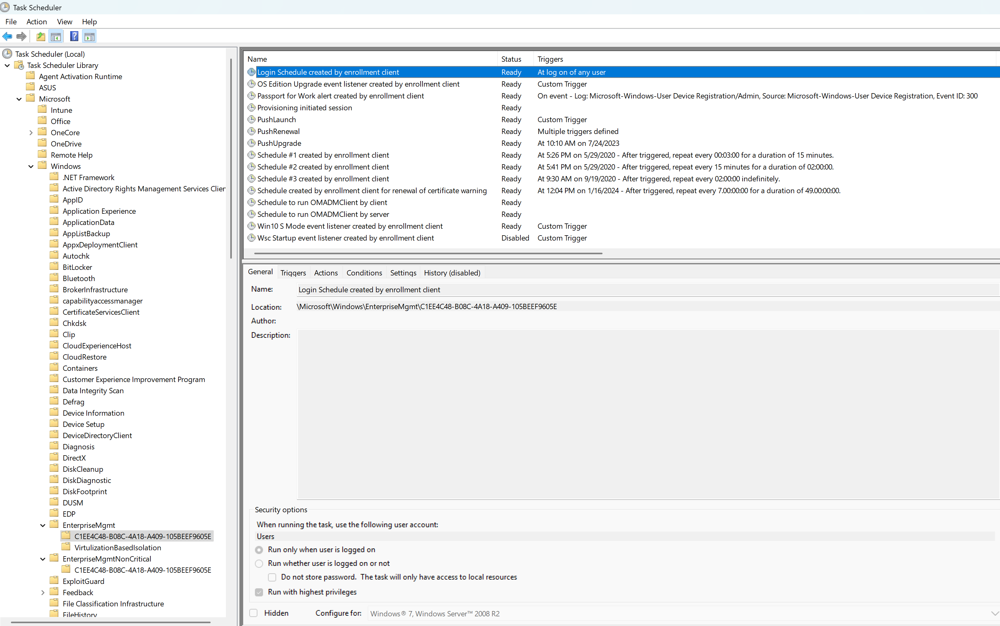
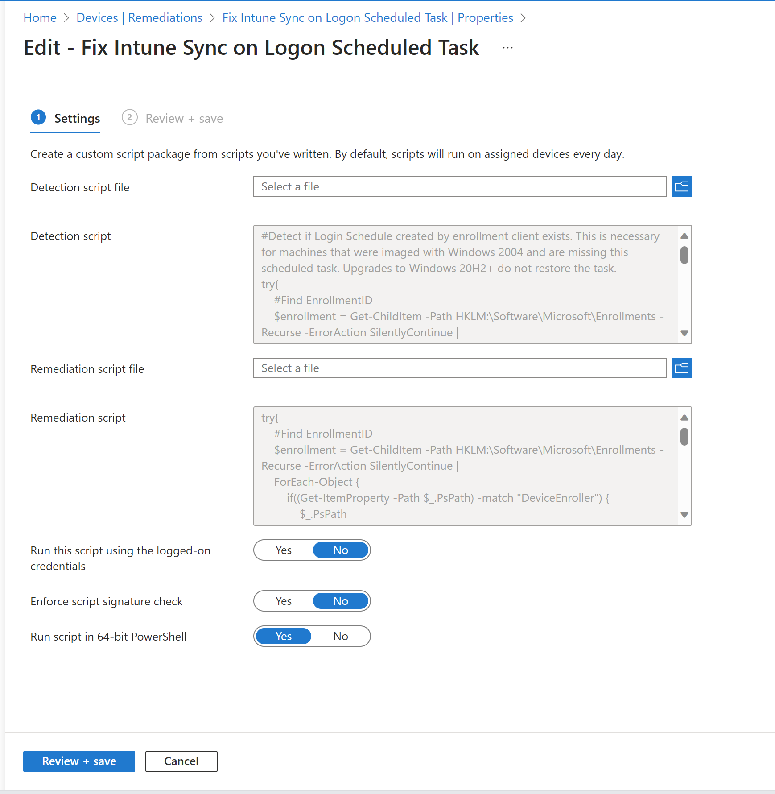

# Fix Intune Sync on Logon

This remediation fixes an issue where the Login Schedule created by enrollment client scheduled task is missing from Windows 10 machines that were imaged with 2004 media. 

# Problem

Windows 2004 media had an issue where the Login Schedule created by enrollment client scheduled task was missing. This cause any user that signed in to not do an immediate sync. This gave the appearence that Intune was "slow". It can definitely be slow for certain things, but for existing policies that have been targeted for days/weeks/months to a user/device, there shouldn't be any slowness of those policies applying.

Where we would primarily see an issue is with user switching. For example, a student may be using a device all day and at the end of the day the student signs out and goes home. An IT admin may need to perform some maintenance (student complained about something not working right). The student may have policies applied to them to restrict access to things like cmd, powershell, etc. however the IT admin doesn't have those restrictions applied to them in Intune. When the IT admin signs in, the expected behavior is that the student policies are removed and the IT admin can access cmd, powershell, etc almost immediately upon getting to the desktop (the scheduled task has to run and the policies need to remove, so there can be a bit of delay, but it should be a few minutes at most, most likely seconds).

Machines that are upgraded to future builds still end up missing this task. This means that for machines that started with 2004 and have taken in-place upgrades up until today, this task is likely missing. I haven't had a chance to validate this going back to 2004 media and doing IPUs through Windows 11 22H2, but it's possible the issue still exists (if you test it, let me know). 

# Resolution

If you're complaining that Intune is slow and not syncing when you sign on, check if this task exists. 

Sign in to your device as an administrator (or run Task Scheduler as an Admin) and navigate to **Microsoft\Windows\EnterpriseMgmt\GUID**

Look for the task **Login Schedule created by enrollment client**

If the task is missing, create a Remediation in Intune and use the Detection and Remediation scripts from this repository. Use the below settings and target the remediation to your devices. 

